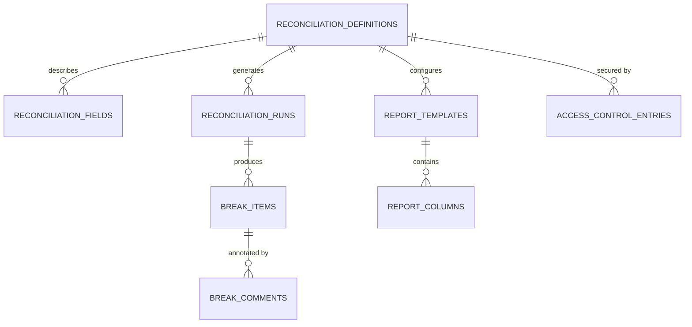

# Database Schema Reference

This document captures the relational model that underpins the Universal Reconciliation Platform. It is intended to orient developers, data engineers, and DBAs when maintaining the schema, troubleshooting data quality issues, or designing integrations.

## Entity relationship diagram

> **Note:** Source system staging tables (`source_a_records` and `source_b_records`) are intentionally decoupled from reconciliation runs at the database level; the matching engine associates records to runs in application memory.

## Core reconciliation metadata

### `reconciliation_definitions`
Defines each reconciliation configuration and is the parent for most other entities.

| Column | Type | Notes |
| --- | --- | --- |
| `id` | `bigint` PK | Auto-increment surrogate key. |
| `code` | `varchar` | Unique human-readable identifier used throughout the application. |
| `name` | `varchar` | Display name shown in UI workflows. |
| `description` | `varchar` | Longer description for analyst context. |
| `maker_checker_enabled` | `boolean` | Toggles maker-checker workflow enforcement. |

**Relationships**
- One-to-many with `reconciliation_fields` (`definition_id`).
- One-to-many with `reconciliation_runs` (`definition_id`).
- One-to-many with `report_templates` (`definition_id`).
- One-to-many with `access_control_entries` (`definition_id`).

### `reconciliation_fields`
Configures how incoming data attributes participate in matching and rollup logic.

| Column | Type | Notes |
| --- | --- | --- |
| `id` | `bigint` PK | |
| `definition_id` | `bigint` FK | Links back to `reconciliation_definitions`. |
| `source_field` | `varchar` | Field name in the ingested source payload. |
| `display_name` | `varchar` | Column title presented in UI/export. |
| `role` | `varchar` | Enum `FieldRole` (IDENTIFIER, MATCH_KEY, MEASURE, etc.). |
| `data_type` | `varchar` | Enum `FieldDataType` (STRING, DECIMAL, DATE). |
| `comparison_logic` | `varchar` | Enum `ComparisonLogic` describing how differences are evaluated. |
| `threshold_percentage` | `numeric` | Optional tolerance for variance-based rules. |

## Run lifecycle and break tracking

### `reconciliation_runs`
Captures each execution of the matching engine, including trigger metadata added in Phase 3.

| Column | Type | Notes |
| --- | --- | --- |
| `id` | `bigint` PK | |
| `definition_id` | `bigint` FK | Parent definition for the run. |
| `run_date_time` | `timestamp` | UTC timestamp when matching executed. |
| `trigger_type` | `varchar` | Enum `TriggerType` (MANUAL, API, SCHEDULED). |
| `status` | `varchar` | Enum `RunStatus` describing completion state. |
| `triggered_by` | `varchar` | Optional LDAP DN or system principal. |
| `trigger_comments` | `varchar` | Free-form submission comments. |
| `trigger_correlation_id` | `varchar` | External reference for API-triggered runs. |
| `matched_count` | `integer` | Aggregated matched record count. |
| `mismatched_count` | `integer` | Aggregated mismatched record count. |
| `missing_count` | `integer` | Aggregated missing record count. |

**Relationships**
- One-to-many with `break_items` (`run_id`).

### `break_items`
Stores each detected exception (“break”) including payload snapshots used in investigations.

| Column | Type | Notes |
| --- | --- | --- |
| `id` | `bigint` PK | |
| `run_id` | `bigint` FK | Owning reconciliation run. |
| `break_type` | `varchar` | Enum `BreakType` (MATCHED_VARIANCE, UNMATCHED_A, etc.). |
| `status` | `varchar` | Enum `BreakStatus` tracking analyst workflow. |
| `product` | `varchar` | High-level categorisation for analytics. |
| `sub_product` | `varchar` | Optional secondary categorisation. |
| `entity_name` | `varchar` | Business entity associated with the break. |
| `detected_at` | `timestamp` | When the variance was identified. |
| `source_a_json` | `clob` | Serialized snapshot of source A attributes. |
| `source_b_json` | `clob` | Serialized snapshot of source B attributes. |

**Relationships**
- One-to-many with `break_comments` (`break_item_id`).

### `break_comments`
Audit trail for analyst actions against a break.

| Column | Type | Notes |
| --- | --- | --- |
| `id` | `bigint` PK | |
| `break_item_id` | `bigint` FK | Parent break. |
| `actor_dn` | `varchar` | LDAP distinguished name of the actor. |
| `action` | `varchar` | Workflow transition label (e.g., ASSIGN, RESOLVE). |
| `comment` | `varchar(2000)` | Analyst note captured alongside the action. |
| `created_at` | `timestamp` | UTC time of the action. |

## Reporting configuration

### `report_templates`
Configurable layouts that drive Excel exports.

| Column | Type | Notes |
| --- | --- | --- |
| `id` | `bigint` PK | |
| `definition_id` | `bigint` FK | Definition the template belongs to. |
| `name` | `varchar` | Display name for selection in the UI. |
| `description` | `varchar` | Longer description for operational context. |
| `include_matched` | `boolean` | Whether matched records are emitted. |
| `include_mismatched` | `boolean` | Whether mismatched breaks are emitted. |
| `include_missing` | `boolean` | Whether missing records are emitted. |
| `highlight_differences` | `boolean` | Toggles cell highlighting in exports. |

**Relationships**
- One-to-many with `report_columns` (`template_id`).

### `report_columns`
Defines each column shown in a template-driven export.

| Column | Type | Notes |
| --- | --- | --- |
| `id` | `bigint` PK | |
| `template_id` | `bigint` FK | Parent template. |
| `header` | `varchar` | Excel header text. |
| `source` | `varchar` | Enum `ReportColumnSource` (METADATA, SOURCE_A, SOURCE_B). |
| `source_field` | `varchar` | Field key resolved at export time (nullable for METADATA). |
| `display_order` | `integer` | Zero-based ordering for column placement. |
| `highlight_differences` | `boolean` | Mirrors template-level highlighting but can be column-specific. |

## Access control and observability

### `access_control_entries`
Maps LDAP groups to reconciliation definitions with optional dimensional scoping.

| Column | Type | Notes |
| --- | --- | --- |
| `id` | `bigint` PK | |
| `ldap_group_dn` | `varchar` | Distinguished name of the security group. |
| `definition_id` | `bigint` FK | Target reconciliation definition. |
| `product` | `varchar` | Optional product filter for entitlements. |
| `sub_product` | `varchar` | Optional sub-product filter. |
| `entity_name` | `varchar` | Optional entity filter. |
| `role` | `varchar` | Enum `AccessRole` (VIEWER, ANALYST, ADMIN). |

### `system_activity_logs`
Persists platform-level audit events surfaced in dashboards.

| Column | Type | Notes |
| --- | --- | --- |
| `id` | `bigint` PK | |
| `event_type` | `varchar` | Enum `SystemEventType` describing the category. |
| `details` | `varchar(2000)` | Render-ready message describing the event. |
| `recorded_at` | `timestamp` | When the event was persisted. |

## Source system staging tables

These tables store the normalized data sets that are reconciled. They are intentionally denormalized to keep the matching engine stateless and performant.

### `source_a_records` & `source_b_records`

| Column | Type | Notes |
| --- | --- | --- |
| `id` | `bigint` PK | |
| `transaction_id` | `varchar` | Natural key from the upstream system (unique). |
| `amount` | `decimal` | Monetary value used in comparisons. |
| `currency` | `varchar` | ISO currency code. |
| `trade_date` | `date` | Business date of the transaction. |
| `product` | `varchar` | Product grouping. |
| `sub_product` | `varchar` | Sub-product classification. |
| `entity_name` | `varchar` | Owning legal entity or desk. |

## Maintenance notes

- Schema is managed via JPA auto DDL in development. For production deployments introduce Liquibase/Flyway migrations to control change history.
- Seed data for local development is stored in [`backend/src/main/resources/data.sql`](../../backend/src/main/resources/data.sql). Update the script when new tables or required reference data are introduced.
- Re-generate ER diagrams by editing the Mermaid block above; many Markdown viewers (including GitHub) render it automatically.

