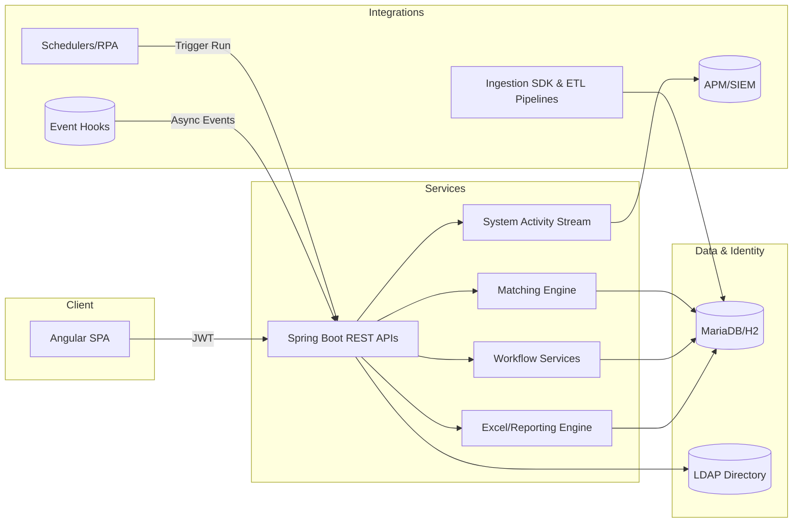
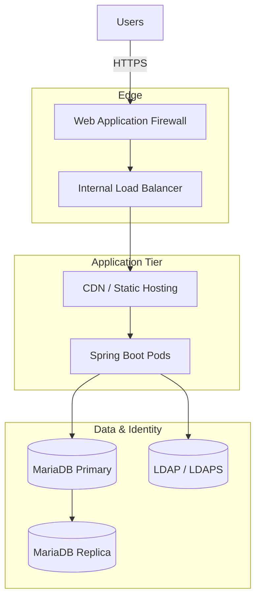

# Platform Architecture

The Universal Reconciliation Platform unifies configurable matching services, workflow automation, and an analyst-friendly UI. This document describes how each layer interacts, the guiding architectural principles, and the runtime/topology views required for implementation or review.

## 1. Architectural Principles
- **Configuration over code:** Reconciliation behavior is captured as metadata stored in MariaDB. Services load definitions at runtime to avoid code deployments for new use cases.
- **Separation of duties:** Maker/checker flows are enforced end-to-end through access control entries, workflow services, and UI guardrails.
- **Hexagonal boundaries:** Controllers convert HTTP requests into service calls; services focus on domain logic; repositories isolate persistence concerns.
- **Observability by design:** Structured system events, run analytics, and export telemetry are emitted for every critical action to support compliance and debugging.
- **Testable slices:** Each layer (backend, frontend, automation, ingestion) exposes fixtures and harnesses to support repeatable testing in CI and local environments.

## 2. Logical Architecture

## 3. Backend Architecture (Spring Boot)

### 3.1 Application Layer
- **Entry Point:** [`UniversalReconciliationPlatformApplication`](../../backend/src/main/java/com/universal/reconciliation/UniversalReconciliationPlatformApplication.java) bootstraps Spring, enables async execution, and loads configuration profiles.
- **Controllers:** REST endpoints are grouped under `controller/`, including reconciliation operations, break management, exports, system activity, authentication, admin metadata, and harness debugging.
- **Exception Handling:** `RestExceptionHandler` translates domain/business exceptions into consistent HTTP responses for the UI.

### 3.2 Domain & Services
- **Domain Entities:** Located under `domain/entity`, representing reconciliations, runs, breaks, approvals, export jobs, transformations, access control entries, and audit events. Entities map to schema documented in [`Database-Schema.md`](Database-Schema.md).
- **DTOs:** `domain/dto` provides serialization-friendly objects that mirror UI contracts, decoupling persistence from payloads.
- **Reconciliation Service:** Coordinates definition access, run execution, break persistence, analytics calculation, and audit events. Depends on repositories and the matching engine.
- **Matching Engine:** `service/matching` provides metadata-driven comparison logic. `MatchingEngine.execute` generates `MatchingResult`, which includes matched counts and break candidates for persistence.
- **Break Lifecycle Services:** Manage filtering, selection, mapping, and permission checks across `BreakService`, `BreakSearchService`, `BreakSelectionService`, `BreakAccessService`, and `BreakMapper`.
- **Export Services:** `ExportService` and `ExportJobService` manage Excel template rendering and asynchronous job orchestration.
- **Workflow & Activity:** `SystemActivityService` captures `SystemEventType` entries for runs, approvals, configuration changes, and exposes feeds via `SystemActivityController`.
- **Ingestion:** `service/ingestion` defines adapters (`CsvIngestionAdapter`, `OpenAiDocumentIngestionAdapter`) and orchestration (`SourceIngestionService`) to normalize inbound data before the matching engine consumes it.
- **Admin Services:** `service/admin/*` maintain reconciliation metadata, transformation scripts, and group assignments with maker/checker enforcement.
- **AI Integrations:** `service/ai` encapsulates GPT-based document enrichment or explanation hints to keep external dependencies isolated.

### 3.3 Persistence Layer
- **Repositories:** Located under `repository`, use Spring Data JPA to query MariaDB/H2. Custom queries power break search pagination and analytics.
- **Transformations:** Scripts and registries in `service/transform` and `domain/transform` support metadata-driven data normalization.
- **Configuration:** `src/main/resources` stores `application.yml`, liquibase scripts (if present), LDAP seeds, and ETL templates.

### 3.4 Security
- **Authentication:** `AuthController` exchanges credentials for JWTs. `UserDirectoryService` integrates with LDAP/LDIF fixtures for development.
- **Authorization:** `UserContext` holds user identity and group DNs; services validate roles (maker/checker) before performing actions.
- **Guards:** Method-level checks and `AccessDeniedException` guard sensitive operations, mirrored in the UI guard/route restrictions.

### 3.5 Testing
- **Unit & Integration Tests:** `backend/src/test/java` includes Spring Boot tests for controllers, services, and repositories.
- **Harness Debugging:** `controller/harness/HarnessDebugController` assists automation and AI sandbox flows.

## 4. Frontend Architecture (Angular 17)

### 4.1 Composition
- **Standalone Components:** Located under `frontend/src/app/components`, providing modular building blocks (reconciliation list, run detail, result grid, break detail, checker queue, system activity, admin console, login).
- **Routing:** `app.routes.ts` orchestrates route-level code splitting and guards to enforce authentication and admin privileges.
- **State Management:** Services such as `ReconciliationStateService`, `ResultGridStateService`, and `AdminReconciliationStateService` expose RxJS observables representing server state.
- **Styling:** Angular Material with shared SCSS tokens defined in `frontend/src/styles.*` ensures UI consistency.

### 4.2 Data Flow
1. `SessionService` stores JWT tokens; `AuthInterceptor` injects them into HTTP requests.
2. `ApiService` functions call backend endpoints and return typed observables.
3. State services combine results into view models consumed by components.
4. Components emit user interactions (filters, run triggers, approvals) back to state services, which invoke additional API calls.
5. Notifications are displayed using `NotificationService` for success/error events.

### 4.3 Testing & Tooling
- Jasmine/Karma specs reside alongside components/services (`*.spec.ts`).
- `npm test -- --watch=false --browsers=ChromeHeadless` executes the suite in CI.
- Playwright automation (see section 6) performs end-to-end validation of the compiled frontend against the backend.

## 5. Data & Integration Architecture

### 5.1 Data Model
- **Reconciliation Definitions:** Metadata describing sources, match keys, tolerances, workflows, and UI presentation.
- **Reconciliation Runs:** Capture execution metadata, counts, and link to break items.
- **Break Items:** Represent unmatched or mismatched records with detailed attributes, workflow state, comments, and audit history.
- **Activity Events:** Structured, immutable records enumerating significant actions for audit and observability.
- **Export Jobs:** Track asynchronous file generation status and metadata for downloads.

### 5.2 Ingestion Lifecycle
1. Source files arrive via CLI or integration harness.
2. Ingestion adapters validate schema, enrich data (optionally via AI), and persist to staging tables.
3. Matching engine pulls metadata and staged data to produce run output.
4. Breaks are persisted; analytics computed; system events recorded.
5. Optional downstream exports or notifications triggered based on run outcome.

### 5.3 External Integrations
- **Schedulers / RPA:** Trigger runs through `/api/reconciliations/{id}/run` using service accounts.
- **Kafka Hooks:** `service/system` (placeholder) can publish run completion events to event streams (illustrated in diagrams, extendable through adapters).
- **Observability:** Activity feed and metrics integrate with enterprise APM/SIEM solutions via structured events and log shipping.

## 6. Automation & Quality Gates
- **Playwright Smoke Tests:** `automation/regression` builds backend/frontend, launches stack, and validates critical UI workflows. `scripts/prepare.mjs` handles orchestration.
- **Seed Validation:** `scripts/seed-historical.sh` and `scripts/verify-historical-seed.sh` load multi-day datasets to catch performance regressions.
- **Examples Harness:** `examples/integration-harness/scripts/run_multi_example_e2e.sh` provisions canonical reconciliations and executes end-to-end flows, useful for demos or regression testing.
- **CI Expectations:** Backend `./mvnw test`, frontend `npm test`, automation `npm test`, plus seed scripts comprise the standard PR checklist.

## 7. Deployment Topology

### Deployment Notes
- Angular assets are built once and deployed to CDN/edge caches; API traffic remains internal behind the load balancer.
- Stateful services (MariaDB, LDAP) run on protected subnets with automated backups and read replicas for analytics/offloading reporting queries.
- Feature flags and configuration reside in the database, reducing environment-specific branching.

## 8. Operational Considerations
- **Logging:** Structured logs emitted from controllers/services include correlation IDs and run identifiers to trace workflows.
- **Monitoring:** System activity events feed dashboards showing run frequency, break volume, approval throughput, and export status.
- **Disaster Recovery:** Seed scripts and example payloads provide rapid data reconstruction for lower environments.
- **Security:** JWT expiry, LDAP sync jobs, and admin guard rails ensure compliance with enterprise governance.

## 9. Documentation & Knowledge Management
- Authoritative documentation is centralized in `docs/wiki`. Key entry points include the onboarding guide, development workflow, database schema, and this architecture overview.
- ADR-style records for major changes are summarized in [`DECISIONS.md`](DECISIONS.md) and expanded in dedicated ADR files when applicable.

This architecture reference should be consulted before introducing new features or refactoring existing modules to ensure consistency with platform design principles.
