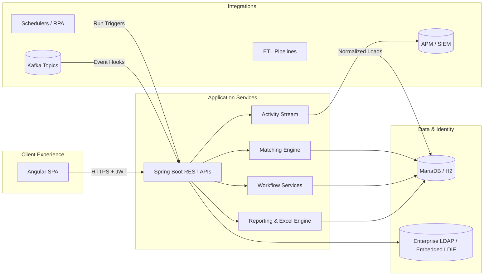
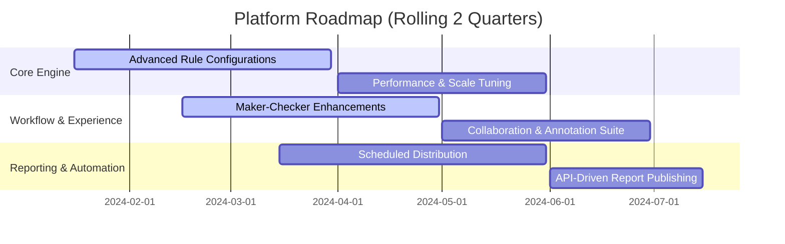

# Universal Reconciliation Platform — Architecture Review Briefing

> Prepared for enterprise architects, product leaders, and delivery stakeholders to facilitate roadmap alignment and solution approval.

## 1. Executive Summary
- **Mission:** Provide a configurable, audit-ready reconciliation fabric that standardizes data matching, exception management, and analytics across the organization.
- **Business impact:** Accelerates onboarding of new reconciliation use cases, reduces manual break handling, and supplies defensible audit evidence for regulators and clients.
- **Technology stance:** Modern Spring Boot + Angular stack backed by MariaDB/H2, metadata-driven configuration, and enterprise-aligned security integrations (LDAP + JWT).

## 2. Strategic Objectives & Value Proposition
| Objective | How the platform delivers |
| --- | --- |
| **Configurability** | Metadata-first definitions enable new reconciliations without code deployments, leveraging reusable ETL blueprints and UI templates. |
| **Governance & Control** | Maker-checker lifecycle, immutable activity feeds, and LDAP-scoped entitlements enforce separation of duties and auditability. |
| **Operational Efficiency** | Analysts receive tailored dashboards, drill-down comparisons, and Excel exports to resolve breaks faster. |
| **Extensibility** | REST APIs, scheduler hooks, and Kafka integrations fit into existing orchestration ecosystems and downstream analytics. |
| **Observability** | System activity logs, metrics, and dashboards surface run health for SRE and compliance teams.

## 3. Solution Architecture Overview

### 3.1 High-Level Component Map

### 3.2 Architectural Layers
- **Client Experience (Angular SPA):** Delivers responsive dashboards, break management consoles, and configuration studios with stateful session handling and drill-down analytics.
- **Application Services (Spring Boot):** Encapsulate reconciliation orchestration, matching passes, workflow state management, export generation, and API surfaces.
- **Data Layer:** MariaDB (production) or H2 (development) stores reconciliation definitions, run outcomes, break inventories, and audit trails.
- **Identity & Security:** LDAP-backed authentication, JWT issuance/validation, and scope-based authorization ensure least-privilege access.
- **Integration Surface:** Metadata-driven ETL runners, REST APIs, Kafka hooks, and scheduled tasks support upstream data ingestion and downstream automation.

### 3.3 Cross-Cutting Concerns
- **Configuration over code:** Every reconciliation definition, field mapping, tolerance, and report layout resides in metadata tables to minimize deployments for business change.
- **Hexagonal boundaries:** Controllers adapt protocols; services remain domain-centric and easily testable.
- **Observability:** Structured activity events, correlation IDs, and Spring Actuator metrics enable runtime diagnostics.
- **Resilience:** Stateless API pods scale horizontally; database replicas support read-heavy analytics; ETL pipelines are idempotent and restartable.

## 4. Platform Differentiators & Advantages
- **Rapid onboarding:** Cloneable configuration templates and sample ETL pipelines compress time-to-value for new reconciliations.
- **End-to-end governance:** Maker/checker, audit logs, and role-based data masking satisfy regulatory oversight requirements.
- **Unified analyst workspace:** Real-time KPI dashboards, filterable break grids, and contextual comparisons accelerate investigation.
- **Automation-ready:** REST and event-driven hooks allow schedulers, RPA, or microservices to trigger runs or consume results programmatically.
- **Operational transparency:** System activity feed, health endpoints, and metrics underpin proactive support and compliance attestations.

## 5. Feature Highlights
| Domain | Representative Capabilities | Business Benefit |
| --- | --- | --- |
| **Configuration Studio** | Dynamic schema builder, reusable templates, environment promotion. | Scale reconciliations without developer cycles. |
| **Matching & Analytics** | Multi-stage rule execution, tolerance-aware comparisons, run analytics & charts. | Boost matching accuracy and visibility. |
| **Workflow & Case Management** | Automated break creation, maker-checker approvals, bulk updates, audit immutability. | Reduce manual handoffs and enforce controls. |
| **Reporting & Distribution** | Excel template engine, on-demand & scheduled exports, compliance archives. | Deliver consumable outputs to stakeholders. |
| **Security & Compliance** | LDAP/JWT identity, scope-based entitlements, configurable data masking. | Align with enterprise security policies. |
| **Operations & Observability** | Health monitoring, self-healing ETL, diagnostics toolset. | Simplify support and incident response. |

## 6. Deployment & Operations Blueprint
- **Topology:** SPA assets via CDN/edge, Spring Boot pods behind internal load balancer, MariaDB primary with optional read replicas, LDAP integration over secure channels.
- **Environments:** Dev (H2 + demo data), local MariaDB, QA/UAT, Production with hardened profiles.
- **CI/CD Flow:** Git commit → CI pipeline (backend + frontend builds) → automated tests & static checks → deploy to Dev → smoke tests → promote to QA/Prod.
- **Security Controls:** TLS termination at WAF/LB, JWT expiration & refresh policies, audit trails for config changes, optional data masking in UI/export layers.
- **SRE Tooling:** Actuator endpoints, structured logs, activity feed streaming to SIEM/observability stack, database backups & point-in-time recovery.

## 7. Roadmap & Investment Themes

- **Focus Areas:** richer rule orchestration, collaboration tooling, automated distribution, scalability hardening.
- **Dependencies:** Kafka/topic governance, enterprise scheduler integration, infrastructure for horizontal scaling.

## 8. Future Enhancement Opportunities
1. **AI-assisted break triage:** Recommend resolution paths using historical break patterns and supervised learning.
2. **Self-service data connectors:** Low-code interface for onboarding new source systems with validation rules and lineage tracking.
3. **Policy-as-code entitlements:** Centralize authorization rules in declarative policies (e.g., OPA) for easier audits.
4. **Domain-specific workspaces:** Tailored dashboards for asset classes or business units with dynamic KPI templates.
5. **Multi-tenant deployment model:** Namespace isolation and configurable branding for shared services or SaaS offerings.
6. **Automated remediation hooks:** Trigger downstream adjustments or journal entries when breaks meet predefined criteria.

## 9. Architecture Review Q&A Preparation
| Likely Question | Prepared Response |
| --- | --- |
| **How does the platform scale with increasing reconciliation volume?** | Stateless Spring Boot pods auto-scale behind the load balancer; matching jobs are batch-oriented with configurable concurrency; database read replicas and partitioning strategies support throughput. |
| **What are the data retention and archival strategies?** | Run results, breaks, and activity logs persist in MariaDB with policy-driven retention; exports can be archived to object storage; scheduled jobs purge or archive historical data per regulatory mandates. |
| **How is disaster recovery handled?** | Infrastructure-as-code provisions redundant environments; database backups and replication enable point-in-time recovery; configuration metadata is exportable for environment rebuilds. |
| **Can third-party tools trigger reconciliations or consume outputs?** | REST endpoints support orchestration; Kafka and scheduler hooks allow event-driven triggers; exports and analytics are accessible via APIs for downstream processing. |
| **What security controls protect sensitive data?** | LDAP-backed authentication, JWT tokens with role scopes, optional data masking, encrypted transport, and immutable audit trails for all user actions. |
| **How are configuration changes governed?** | Metadata updates require maker-checker approval; activity feed records changes; configuration packages support promotion workflows with review gates. |
| **What observability is available for operations teams?** | Structured activity logs, correlation IDs, Actuator metrics, and integration with enterprise SIEM/APM platforms provide full run telemetry. |
| **How does the platform support customization without forks?** | Hexagonal architecture and metadata extensibility allow custom rules, UI cards, or reports through configuration or pluggable modules, preserving upgrade paths. |

## 10. Developer Experience
### 10.1 Onboarding & Tooling
- **Prerequisites:** JDK 17+, Maven 3.9+, Node.js 18+, optional Docker for MariaDB/LDAP containers.
- **Bootstrap steps:** `./mvnw dependency:go-offline` for backend, `npm install` for frontend, optional profile overrides via `application-local.yml` and Angular environment files.
- **Sample data:** `SampleEtlRunner` seeds demo datasets and reconciliation definitions for immediate testing.

### 10.2 Local Development Flow
1. Start backend: `cd backend && ./mvnw spring-boot:run` (use `dev` profile for H2 + demo data).
2. Start frontend: `cd frontend && npm start`, then authenticate via demo credentials at `http://localhost:4200`.
3. Iterate with hot reload for Angular components and Spring DevTools (optional) for backend.

### 10.3 Quality Gates & Automation
- **Tests:** `./mvnw test` for backend suites; `npm test -- --watch=false --browsers=ChromeHeadless` for frontend; `npm run lint` for code quality.
- **End-to-end smoke:** `automation/regression` package offers scripted regression runs once dependencies installed.
- **CI/CD:** Unified pipeline builds backend & frontend artifacts, runs automated checks, and controls environment promotions via gated approvals.

### 10.4 Collaboration & Documentation
- Central wiki under `docs/wiki` hosts architecture diagrams, feature compendium, developer workflows, and onboarding guides.
- Decision records captured as ADRs under `docs/wiki/adr-<topic>.md` to document architectural changes.
- Examples directory provides runnable reconciliation scenarios with ETL pipelines and automated tests for reference implementations.

### 10.5 Developer Support Practices
- **Observability:** Actuator endpoints & structured logs simplify local debugging; activity feed verifies workflow events.
- **Data refresh:** Restart backend (H2) or rerun ETL pipelines to regenerate sample data; scripts provided for MariaDB cleanups.
- **Security testing:** Embedded LDAP configuration allows experimentation with entitlements before promoting to enterprise directories.

## 11. Next Steps for Reviewers
- Validate roadmap priorities against organizational objectives.
- Confirm infrastructure alignment (network zones, database services, LDAP connectivity).
- Identify compliance or integration requirements requiring additional design.
- Provide feedback on future enhancement priorities for backlog shaping.

---
*For deeper dives, reference [Architecture](Architecture.md), [Feature Compendium](features.md), [Development Workflow](Development-Workflow.md), and [Getting Started](Getting-Started.md) within the project wiki.*
