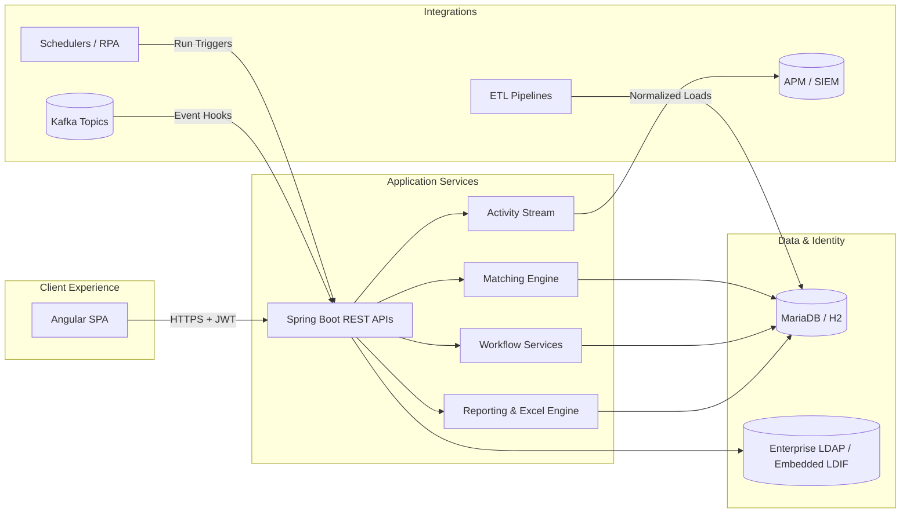
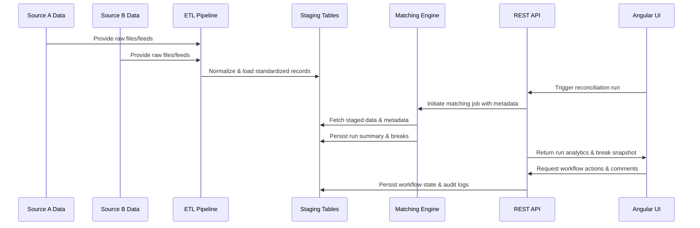
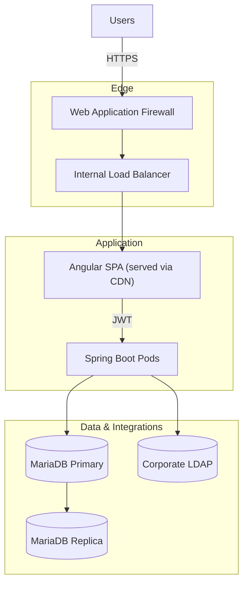
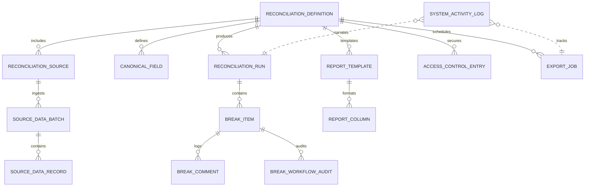

## 2. Project Architecture

### 2.1 High-Level Overview

### 2.2 Key Components
- **Angular SPA:** Presents dashboards, run controls, break management, and reporting interfaces. Communicates with the backend via secured REST APIs.
- **Spring Boot services:** Expose endpoints, orchestrate matching runs, manage workflow state, and generate exports.
- **Dynamic matching engine:** `DynamicMatchingEngine` loads canonical field configuration, reconciles across any number of sources, applies tolerance-aware comparators, and persists consolidated break payloads.
- **Workflow services:** Handle maker/checker transitions, comments, audit logging, and saved selections.
- **Export services:** Generate immediate run reports and manage queued dataset jobs that stream CSV/JSONL/XLSX/PDF artefacts.
- **Activity service:** Streams structured events for observability, compliance, and analytics.
- **Ingestion adapters:** Metadata-driven pipelines (CSV, REST, JDBC, fixed-width, JSON, XML, message queues, and LLM-backed document extraction) orchestrate data ingest and downstream automation through `SourceIngestionService`.
- **Admin configurator:** Multi-step Angular workspace backed by REST endpoints. Source Schema persists per-source column metadata for transformation previews and matching dropdowns. Schema inference and transformation previews reuse the backend parser toolkit to detect column names, data types, and sample rows from uploaded files or recent batches.
- **Observability stack:** Activity telemetry and platform metrics flow into enterprise APM/SIEM tooling for health monitoring.

### 2.3 Design Patterns Used
- **Hexagonal architecture:** Controllers adapt HTTP requests into service calls; services remain domain-focused and persistence-agnostic.
- **Configuration over code:** Reconciliation behaviors and UI presentations are driven by metadata stored in the database.
- **Event sourcing lite:** Activity feed persists immutable events for each significant action.
- **Dependency injection:** Spring and Angular rely on constructor injection for explicit dependency management and testability.

### 2.4 Data Flow

### 2.5 Deployment Topology
The platform is typically deployed across three tiers to isolate user traffic, service execution, and persistent data.

**Deployment notes**
- Angular assets are served via CDN/edge caching while API calls terminate at the internal load balancer.
- Stateful services (MariaDB) reside on a protected subnet with automated backups and read replicas for analytics.

## 4. Code Organization

### 4.1 Directory Structure
| Path | Purpose |
| --- | --- |
| `backend/src/main/java` | Spring Boot application, controllers, services (matching, ingestion, exports, AI helpers), domain model, repositories. |
| `backend/src/main/resources` | Configuration files, ETL fixtures, application properties, and embedded LDAP data. |
| `backend/src/test/java` | Unit and integration tests with Spring Boot Test. |
| `frontend/src/app` | Angular standalone components, services, and routing. |
| `frontend/src/environments` | Environment-specific configuration files. |
| `docs/wiki` | Centralized wiki with feature, developer, and onboarding guides. |
| `docs/Bootstrap.md` | Historical project charter and phased rollout notes. |

### 4.2 Key Files
- `UniversalReconciliationPlatformApplication.java` – Application entry point and bootstrap configuration.
- `ReconciliationController.java` – REST surface for listing reconciliations, triggering runs, and retrieving analytics.
- `BreakController.java` – Orchestrates maker/checker workflow actions, comments, and bulk updates.
- `ExportController.java` – Streams run-level XLSX exports derived from configured report templates.
- `DynamicMatchingEngine.java` – Executes metadata-driven comparisons for reconciliations with any number of sources.
- `SourceIngestionService.java` – Projects raw source payloads into canonical fields using transformation plans and adapter metadata.
- `OpenAiDocumentIngestionAdapter.java` – LLM-powered ingestion adapter that extracts structured data from unstructured documents.
- `ExportJobController.java` / `ExportJobService.java` – Manage asynchronous dataset exports and secure downloads.
- `EtlBootstrapper.java` – Discovers `EtlPipeline` beans (from examples or integration harnesses) and executes them at startup.
- `frontend/src/app/services/reconciliation-state.service.ts` – Angular service managing global reconciliation state.
- `frontend/src/app/services/result-grid-state.service.ts` – Coordinates grid filters, saved views, and export polling.

### 4.3 Important Modules
- **Matching module (`service/matching`):** `DynamicMatchingEngine` works with `DynamicReconciliationContextLoader` to hydrate canonical fields, resolve anchor/secondary datasets, and output `BreakCandidate` aggregates.
- **Ingestion & transformation (`service/ingestion`, `service/transform`):** `SourceIngestionService` coordinates adapter execution, applies transformation plans via `SourceTransformationPlanProcessor`, and persists canonical payloads.
- **Break management (`service/BreakService`, `BreakAccessService`):** Applies maker/checker rules, enforces security scopes, and persists comments or status updates.
- **Analytics (`service/RunAnalyticsCalculator`):** Computes chart-ready aggregations for the dashboard, including break counts by status, type, product, and age buckets.
- **Exporting (`service/ExportService`, `service/ExportJobService`):** Generates on-demand run workbooks and manages asynchronous dataset jobs with entitlement-aware downloads.
- **AI helpers (`service/ai`):** `DefaultOpenAiClient` and prompt utilities back the LLM ingestion adapter and transformation assistants.
- **Security (`config/SecurityConfig`, `security/*`):** Configures Spring Security with LDAP authentication, JWT issuance/validation, and per-request user context resolution.
- **ETL pipelines (`etl/*`):** `EtlPipeline` implementations contributed by examples or integration harnesses are discovered and executed automatically to seed demo data.

## 5. Core Concepts

### 5.1 Domain Models

### 5.2 Key Interfaces & Services
- `MatchingEngine` – Abstraction for executing the matching algorithm; implemented by `DynamicMatchingEngine`.
- `ReconciliationService` – Coordinates entitlement checks, invokes the matching engine, persists runs, and assembles `RunDetailDto` responses.
- `BreakService` – Applies maker/checker rules, updates break status, and appends comments through transactional operations.
- `BreakAccessService` – Filters breaks and reconciliations based on LDAP group entitlements and optional dimensional restrictions.
- `RunAnalyticsCalculator` – Aggregates break data into charts consumed by the Angular dashboard.
- `ExportService` – Generates Excel exports leveraging Apache POI and the configured report templates.
- `ExportJobService` – Queues, processes, and secures asynchronous dataset exports using `DatasetExportWriter`.
- `SystemActivityService` – Persists audit events (`SystemEventType`) and exposes them to the `/api/activity` endpoint.
- `UserContext` – Lightweight wrapper around Spring Security providing current username and group memberships for downstream services.
- `AdminSourceSchemaService` – Reuses the transformation preview pipeline to infer per-source schema metadata (field name, data type, required flag, sample rows) from administrator-provided files. `AdminReconciliationService` stores the resulting schema fields alongside each `ReconciliationSource` and exposes them to the UI and schema export endpoints.
- `OpenAiDocumentIngestionAdapter` – Uses Apache Tika and OpenAI responses to turn unstructured documents into structured records that flow through the standard ingestion pipeline.

### 5.3 Application Properties
| Property | Purpose | Example |
| --- | --- | --- |
| `spring.datasource.url` | JDBC connection string; defaults to in-memory H2 for local development. | `jdbc:mariadb://localhost:3306/recon` |
| `spring.jpa.hibernate.ddl-auto` | Controls schema management strategy (`update` in dev, `validate` in prod). | `update` |
| `app.security.jwt.secret` | Symmetric key used to sign JWTs; set via environment variable in every environment. | `change-me-super-secret` |
| `app.security.jwt.expiration-seconds` | Token lifetime expressed in seconds. | `86400` |
| `app.security.ldap.people-base` | LDAP base DN for users; override when binding to enterprise directories. | `ou=people,dc=corp,dc=example` |
| `app.security.cors.allowed-origins[0]` | Allowed frontend origins for browser requests. | `http://localhost:4200` |
| `logging.level.com.universal.reconciliation` | Fine-tunes logging verbosity for application packages. | `DEBUG` |
