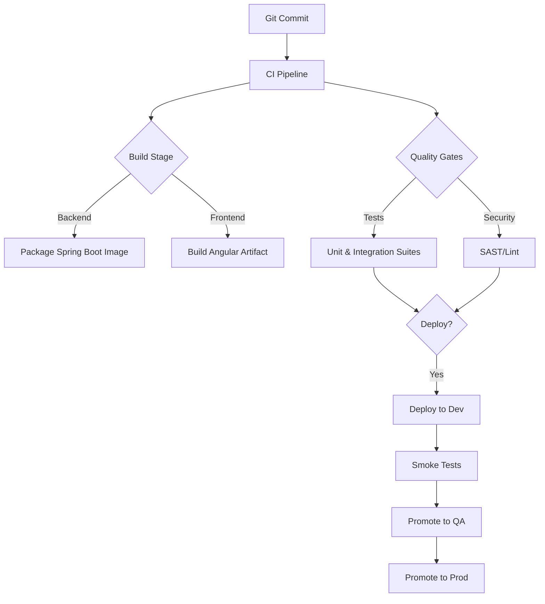

## 6. Development Workflow

### 6.1 Building
- **Backend:** `cd backend && ./mvnw clean package`
- **Frontend:** `cd frontend && npm run build`

### 6.2 Testing
- **Backend unit/integration tests:** `cd backend && ./mvnw test`
- **Frontend tests:** `cd frontend && npm test -- --watch=false --browsers=ChromeHeadless`
- **Linting (optional but recommended):** `cd frontend && npm run lint`
- **End-to-end regression smoke:** `cd automation/regression && npm install && npm test`

### 6.4 Deployment Pipeline

## 8. Common Tasks

### 8.1 Onboarding a New Reconciliation Definition
1. Sign in with an account that carries `ROLE_RECON_ADMIN` (the embedded `admin1/password` demo user is pre-provisioned) and navigate to the **Administration** workspace.
2. Use the **Create reconciliation** wizard to capture definition metadata (code, description, maker/checker flag) and add at least one anchor source.
3. Define canonical fields for the reconciliation, mapping each to source columns within the wizard. Ensure key fields are flagged with the `KEY` role and tolerance values are provided where needed.
4. Assign optional report templates and LDAP access control entries before reviewing and publishing the configuration. The backend enforces optimistic locking via the `version` field.
5. Download the schema export from the detail view (or `GET /api/admin/reconciliations/{id}/schema`) and share it with the ETL team so ingestion jobs align with the published contract.
6. Once source data lands—either through direct MariaDB inserts or the `/api/admin/reconciliations/{id}/sources/{code}/batches` ingestion endpoint—trigger the reconciliation run and confirm analytics/breaks behave as expected.
7. The `examples/admin-configurator` bootstrap script provisions the same reconciliation via REST and uploads a sample CSV batch; use it to validate API contracts or hand off to ETL teams.

### 8.2 Generating and Sharing an Excel Export
1. Trigger or locate a run using `GET /api/reconciliations/{id}/runs/latest`.
2. Download the workbook with `GET /api/exports/runs/{runId}` (supply the JWT in the `Authorization` header).
3. Store the binary response as `reconciliation-run-<runId>.xlsx` and distribute to stakeholders via secure channels.
4. Confirm the download was captured in the activity feed (`SystemEventType.REPORT_EXPORT`).
5. For large, filter-aware extracts use the asynchronous pipeline: `POST /api/reconciliations/{id}/export-jobs` queues a dataset job and `GET /api/export-jobs/{jobId}/download` retrieves the CSV/JSONL/XLSX/PDF artifact once complete.

### 8.3 Debugging ETL Issues
1. Start the backend with the default profile; `EtlBootstrapper` logs each discovered `EtlPipeline` execution at INFO level.
2. Inspect the application console output (or configured log appender) for pipeline-specific errors (e.g., malformed CSV rows or transformation failures).
3. Query the canonical staging tables (`source_data_batches`, `source_data_records`) to verify record counts and key fields; use the H2 console (`/h2-console`) in dev.
4. To rerun a single pipeline, autowire the component in a Spring test or temporary REST endpoint and call its `run()` method manually, or trigger ingestion via `/api/admin/reconciliations/{id}/sources/{code}/batches` to exercise the same `SourceIngestionService` path used in production.

### 8.4 Observing Reconciliation Runs
1. `ReconciliationService` now emits an INFO log with the triggering user, correlation ID, and resulting match counts. Capture these logs alongside the system activity table to cross-reference user actions.
2. `DynamicMatchingEngine` surfaces DEBUG-level summaries (matched/mismatched/missing counts) keyed by definition and source codes. Enable the logger temporarily when triaging tolerance or key configuration issues.
3. Workflow changes applied through `BreakService` output INFO logs summarising single and bulk updates (including correlation IDs). Pair these with Playwright evidence whenever maker-checker policies are adjusted.

### 8.5 Troubleshooting Authentication
- Confirm LDAP settings in `application.yml`/`application-local.yml` (`app.security.ldap.*`, `spring.ldap.*`) align with your directory.
- When using embedded LDAP, update `ldap-data.ldif` to reflect desired demo users and groups.
- Enable DEBUG logging for `org.springframework.security` temporarily to trace bind attempts and JWT validation issues.
