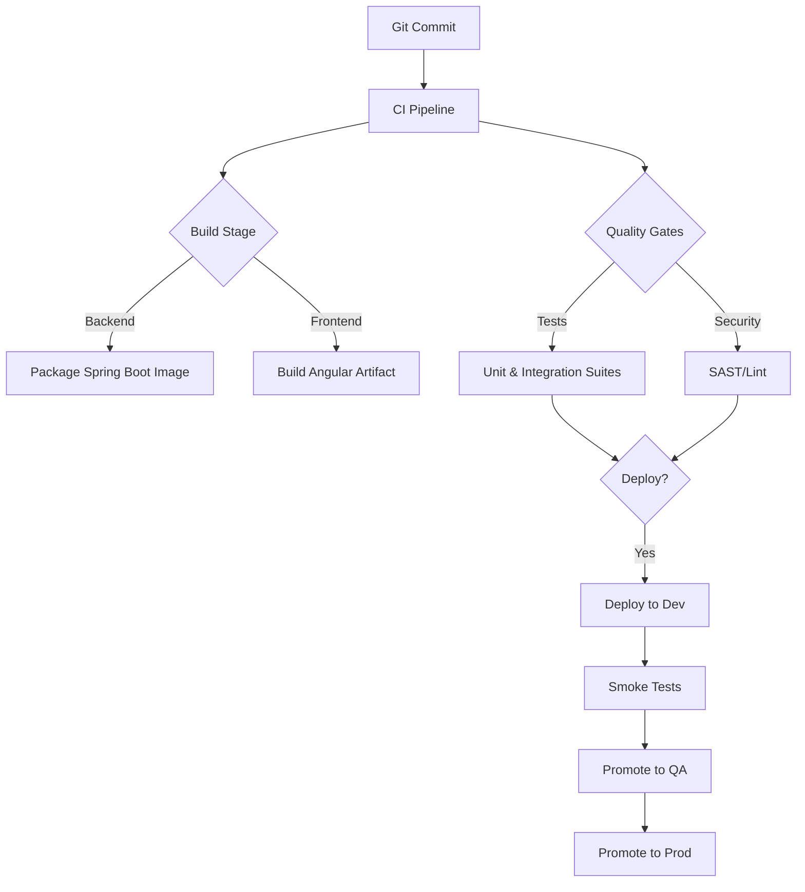

## 6. Development Workflow

### 6.1 Building
- **Backend:** `cd backend && ./mvnw clean package`
- **Frontend:** `cd frontend && npm run build`

### 6.2 Testing
- **Backend unit/integration tests:** `cd backend && ./mvnw test`
- **Frontend tests:** `cd frontend && npm test -- --watch=false --browsers=ChromeHeadless`
- **Linting (optional but recommended):** `cd frontend && npm run lint`

### 6.4 Deployment Pipeline

## 8. Common Tasks

### 8.1 Onboarding a New Reconciliation Definition
1. Insert a row into `reconciliation_definitions` with a unique `code`, descriptive `name`, and `maker_checker_enabled` flag.
2. Populate `reconciliation_fields` for the definition, marking at least one `KEY` and the desired `COMPARE` fields (specify `comparison_logic` and `threshold_percentage` where required).
3. Load or stream source data into `source_a_records` and `source_b_records` with matching `definition_id` values. Use the existing ETL pipeline classes as templates for ingestion.
4. Configure `access_control_entries` to map LDAP groups to the definition and optional product/entity slices.
5. Trigger the run via the UI or `POST /api/reconciliations/{id}/run`, then review analytics and breaks to confirm alignment.

### 8.2 Generating and Sharing an Excel Export
1. Trigger or locate a run using `GET /api/reconciliations/{id}/runs/latest`.
2. Download the workbook with `GET /api/exports/runs/{runId}` (supply the JWT in the `Authorization` header).
3. Store the binary response as `reconciliation-run-<runId>.xlsx` and distribute to stakeholders via secure channels.
4. Confirm the download was captured in the activity feed (`SystemEventType.REPORT_EXPORT`).

### 8.3 Debugging ETL Issues
1. Start the backend with the default profile; `SampleEtlRunner` logs each pipeline execution at INFO level.
2. Inspect the application console output (or configured log appender) for pipeline-specific errors (e.g., malformed CSV rows).
3. Query `source_a_records` and `source_b_records` to verify record counts and key fields; use the H2 console (`/h2-console`) in dev.
4. To rerun a single pipeline, autowire the component in a Spring test or temporary REST endpoint and call its `run()` method manually.

### 8.4 Troubleshooting Authentication
- Confirm LDAP settings in `application.yml`/`application-local.yml` (`app.security.ldap.*`, `spring.ldap.*`) align with your directory.
- When using embedded LDAP, update `ldap-data.ldif` to reflect desired demo users and groups.
- Enable DEBUG logging for `org.springframework.security` temporarily to trace bind attempts and JWT validation issues.
