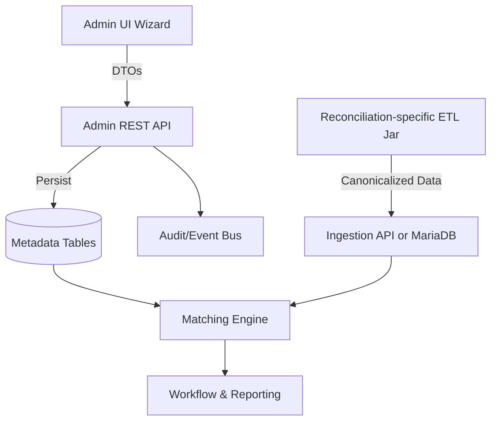

# Feature Request: Admin Reconciliation Configurator

## Overview
- **Problem statement:** Onboarding a new reconciliation requires custom Spring components and manual seed scripts, which slows delivery and tightly couples ETL logic to the platform runtime.
- **Desired outcome:** Enable a single running instance of the platform to host any number of reconciliations whose metadata is authored by administrators through a UI, while individual recon teams ship lightweight ETL jars that only parse source files and persist canonicalized data into MariaDB or the ingestion API.
- **Primary personas:** Platform administrators (configure reconciliations), recon ETL developers (produce source-specific ingestion jars), operations and analyst users (consume reconciliations without redeploying the platform).

## Goals & Non-Goals
### Goals
1. Provide secure administrative APIs to create, update, and retire reconciliation metadata without code changes.
2. Deliver an Angular-based administration workspace with a guided wizard for defining reconciliations, sources, canonical fields, reports, and access policies.
3. Document ingestion contracts so external ETL jars can align with canonical schemas and push data without depending on platform releases.
4. Maintain a single shared runtime for matching, workflow, scheduling, and reporting across all configured reconciliations.

### Non-Goals
- Rewriting the core matching algorithms or workflow engine.
- Bundling ETL pipelines inside the platform deployment.
- Supporting legacy seed-script onboarding except for migration utilities.

## Scope Summary
| Area | Included | Excluded |
| --- | --- | --- |
| Backend | Admin REST surface, validation services, ingestion schema export, audit events | New matching rules |
| Frontend | Admin routing, reconciliation builder wizard, catalog views, integration aids | Analyst UI redesign |
| Data | Versioning metadata, soft-retire flags, adapter option storage | Historical data migration |
| Ops | RBAC configuration, documentation, rollout plan | Infrastructure scaling changes |

## Architectural Context

## Functional Requirements
1. Administrators can create reconciliation definitions, including human-readable metadata, maker-checker settings, and audit notes.
2. Administrators can register one or more sources per reconciliation, select an ingestion adapter (CSV, JDBC, API), mark an anchor source, and configure adapter-specific options.
3. Canonical fields support roles (KEY, COMPARE, CLASSIFIER, ATTRIBUTE), data types, tolerances, formatting hints, and display ordering.
4. Report templates store layout metadata, break presentation columns, and filters.
5. Access-control entries map LDAP groups to maker/checker/analyst scopes, optional dimensional filters, and notification preferences.
6. API consumers can fetch reconciliation schemas and ingestion endpoints for automation tooling.
7. Configuration changes emit audit events and respect optimistic locking.
8. Retiring a reconciliation hides it from analyst lists without deleting historical runs.
9. Reconcillation auto-trigger and schedulers.

## Acceptance Criteria
- **CRUD operations** for reconciliation definitions, sources, fields, reports, and access entries are protected by `ROLE_RECON_ADMIN`.
- **Validation errors** are returned with actionable messages (e.g., duplicate code, missing anchor source, missing key field).
- **UI wizard** enforces sequential steps and prevents submission until all required data is provided.
- **Schema export endpoint** returns canonical field metadata consumable by ETL developers and is referenced from the UI.
- **Audit trail** entries appear in the activity feed whenever admin changes occur.
- **Single platform instance** lists and executes newly configured reconciliations immediately after data ingestion without redeployment.

## Backend Implementation Plan
### API Surface
- `GET /api/admin/reconciliations`: Paginated list with filters by status, last modified, and owner.
- `POST /api/admin/reconciliations`: Create a reconciliation with nested sources, fields, reports, and ACLs.
- `GET /api/admin/reconciliations/{id}`: Retrieve full configuration graph for editing.
- `PUT /api/admin/reconciliations/{id}`: Replace configuration graph with validations and optimistic locking.
- `PATCH /api/admin/reconciliations/{id}`: Partial updates for targeted edits (e.g., toggle maker-checker).
- `DELETE /api/admin/reconciliations/{id}`: Soft-retire with timestamp and actor metadata.
- `GET /api/admin/reconciliations/{id}/schema`: Publish canonical field schema, source codes, adapter types, and ingestion hints.
- `POST /api/admin/reconciliations/{id}/sources/{code}/batches`: Optional HTTP ingestion endpoint used by recon-specific ETL jars.

### Services & Domain Changes
- Introduce `AdminReconciliationService` that orchestrates validation, mapping, and persistence of the reconciliation aggregate.
- Add mapper classes (e.g., MapStruct) for DTO <-> entity conversions.
- Implement validation components for anchor source enforcement, key field presence, and tolerance formats.
- Extend metadata entities with `@Version` fields for optimistic locking and `retiredAt`/`retiredBy` columns for soft deletion.
- Publish configuration change events (`ReconciliationConfigChangedEvent`) for the activity feed and audit logs.

### Security & Infrastructure
- Extend Spring Security to require `ROLE_RECON_ADMIN` on admin endpoints and expose necessary CORS/HTTP methods.
- Update Flyway/Liquibase migrations for new columns and indexes (e.g., `retired_at`).
- Document environment variable updates for admin role mapping and ingestion endpoint configuration.

## Frontend Implementation Plan
### Navigation & Access Control
- Add an "Administration" entry in the authenticated shell, visible only when the JWT contains the admin role claim.
- Lazy-load an `AdminModule` to minimize bundle impact on analyst users.

### Reconciliation Builder Wizard
1. **Definition Step:** Code, name, description, maker-checker flag, operational notes.
2. **Source Step:** Dynamic form array for sources capturing adapter type, anchor toggle, connection options (JSON editor for advanced settings), and arrival expectations.
3. **Schema Step:** Canonical fields with role selection, data type, tolerance (with percent or absolute options), and display order drag-and-drop.
4. **Reports Step:** Configure report templates, column mappings, and default filters using existing grid component patterns.
5. **Access Step:** Assign maker/checker/analyst groups, dimensional filters, and notification preferences.
6. **Review & Publish:** Summarize configuration, highlight validation warnings, and submit to the backend.

### Catalog & Detail Views
- List view showing reconciliation code, status, last modified, owners, and quick actions (edit, duplicate, retire).
- Detail view providing read-only configuration, schema export download, and REST endpoint snippets for ETL developers.
- Activity panel that surfaces configuration change history.

### Integration Utilities
- Provide download buttons for schema JSON and starter ETL config YAML.
- Surface ingestion endpoint examples (`curl` and Java snippets) contextualized per source.
- Display latest ingestion batches (timestamp, record counts) sourced from backend statistics.

### State Management & UX
- Implement `AdminReconciliationStateService` to cache listings, handle optimistic concurrency errors, and coordinate wizard data.
- Use Angular reactive forms with validators mirroring backend rules.
- Reuse design system components (cards, steppers, tables) for visual consistency.

## Custodian Reconciliation Example Workflow
1. **Admin authoring:** Admin creates `CUSTODY_GL` reconciliation, adds `CUSTODY_FEED` (CSV adapter, anchor) and `GL_LEDGER` (JDBC adapter). Defines key fields (`tradeId`, `settlementDate`), comparison fields (`netAmount` with ±0.5% tolerance, `currency` case-insensitive), and classifiers (`product`, `entity`). Configures a Break Investigation report and assigns maker/checker LDAP groups. Configure auto reconcillation when all sources available or cutoff reconcillation by specific scheduler timings if auto reconcillation didn't trigger by that time.
2. **ETL implementation:** Custodian recon team builds a jar that parses CSV inputs, transforms them into the canonical schema from `/schema`, and writes batches via JDBC or the ingestion API endpoint.
3. **Operations:** Once data lands, the configured platform scheduler triggers matching and populates dashboards, breaks, and reports without any platform redeployments.

## Data Model Impacts
- Metadata tables gain versioning and retirement columns.
- New tables or JSON columns store adapter-specific options and report layouts authored via the UI.
- Activity feed includes configuration events referencing reconciliation IDs, actor, timestamp, and change summary.

## Testing Strategy
- **Unit Tests:** DTO mappers, validation rules, security guards.
- **Integration Tests:** CRUD lifecycle tests ensuring cascading persistence, audit event emission, and optimistic locking behavior.
- **API Contract Tests:** Ensure schema endpoint produces expected shapes and ingestion endpoint accepts canonical payloads.
- **Frontend Unit Tests:** Form validators, state service, component rendering of wizard steps.
- **E2E Tests:** Cypress/Playwright scenarios covering end-to-end admin configuration and ingestion handshake.
- **Performance Tests:** Validate admin CRUD and ingestion endpoints under expected concurrent usage.

## Rollout & Migration
1. Ship read-only admin catalog using existing metadata to familiarize users.
2. Enable creation/editing behind feature flag for pilot administrators.
3. Migrate existing hardcoded reconciliations by exporting their metadata and importing via the new APIs.
4. Decommission legacy seeders once all reconciliations are managed through the UI.

## Documentation & Training
- Update `API-Reference.md` with new admin endpoints.
- Extend `Development-Workflow.md` to cover ETL jar integration using the schema exports.
- Produce admin user guide and video walkthrough aligned with the wizard.
- Share sample ETL starter projects referencing the new ingestion contract.

## Risks & Mitigations
| Risk | Mitigation |
| --- | --- |
| Incorrect configurations impacting production runs | Add draft/publish workflow and validation previews before activation |
| Schema drift between UI and ETL jars | Provide schema versioning and compatibility checks | 
| Role misconfiguration granting excessive access | Enforce admin-only feature flag and comprehensive audit trail |
| Performance bottlenecks on ingestion endpoint | Support direct MariaDB writes as alternative path with documented schema |

## FAQ
1. Should reconciliation configurations support version history and rollback beyond soft-retire? If yes, design archival tables.
A: Yes
2. Do we need a staging status (draft vs. published) to allow multi-step authoring before activation?
A: Yes

## Success Metrics
- Time to onboard a new reconciliation drops from weeks to days without platform redeployments.
- Number of reconciliations hosted in a single platform instance increases without matching performance degradation.
- 100% of configuration changes are traceable to admin users with audit logs and activity feed entries.
- ETL teams independently deliver ingestion jars using the published schema contracts.

