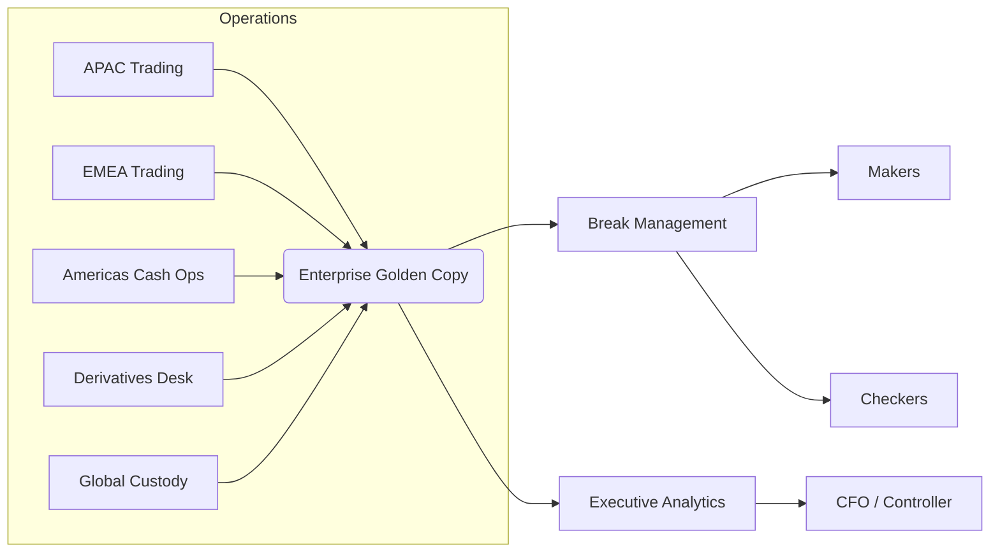
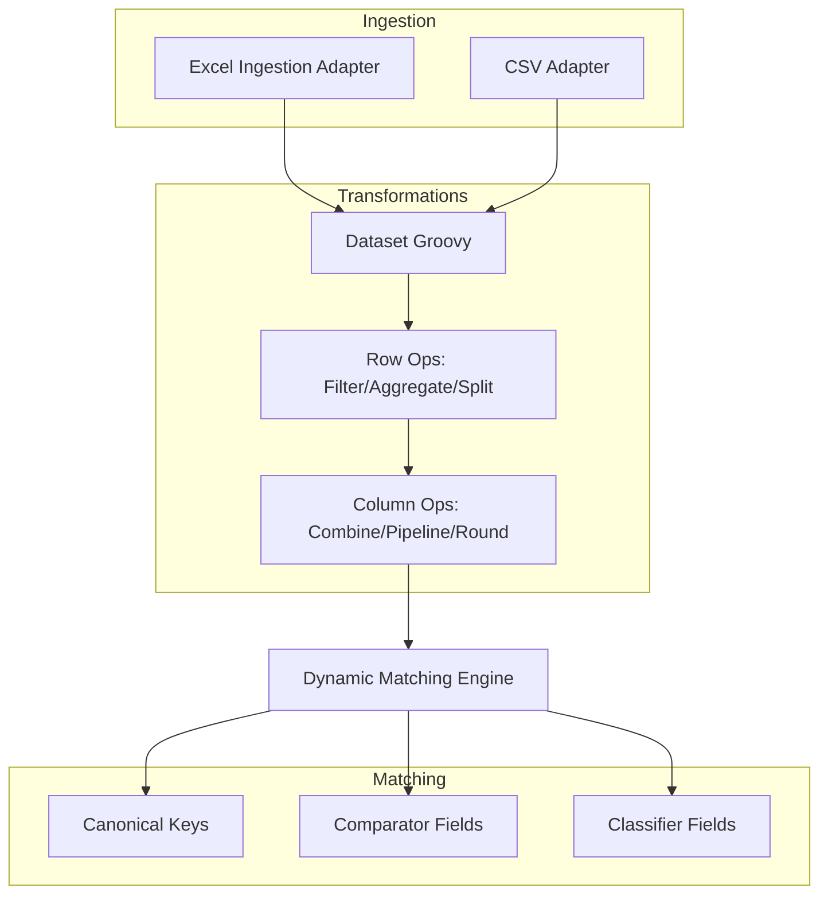

# Global Multi-Asset Reconciliation Playbook

This playbook documents the "Global Multi-Asset Golden Copy" example that ships with the automation
harness. It demonstrates how to reconcile six heterogeneous sources (multi-sheet Excel, CSV, and
pipe-delimited text) against a single enterprise master while exercising every transformation and
matching capability that the platform provides.

## Business Context
- Consolidate APAC, EMEA, Americas cash, derivatives, and custody feeds into a regulated golden copy.
- Capture full trade lifecycle (booking → affirmation → funding → safekeeping) without replicating code.
- Provide audit-ready maker/checker controls across regions with tolerance-aware matching.



## Technical Implementation
- **Source formats:**
  - `GLOBAL_MASTER` anchor workbook with three sheets (Positions, Financing, Alternatives).
  - Two additional multi-sheet Excel sources (`APAC_MULTI`, `EMEA_MULTI`).
  - Two CSV feeds (`AMERICAS_CASH`, `DERIVATIVES_FEED`) and one pipe-delimited text file (`GLOBAL_CUSTODY`).
- **Transformations:** Dataset Groovy enrichments, row filters/aggregations/splits, and column combine,
  pipeline, and rounding operations normalise each source into canonical `derived_*` columns.
- **Matching:** Keys and comparators cover exact, case-insensitive, numeric threshold, and date-only
  logic; classifiers populate maker/checker pivots.
- **Automation:** Scenario is bootstrapped via `examples/integration-harness/payloads/global-multi-asset.json`
  and fixtures in `examples/integration-harness/src/main/resources/data/global-multi-asset/`.



### Transformation coverage
| Source | Dataset script | Row ops | Column ops | Canonical transformations |
| --- | --- | --- | --- | --- |
| GLOBAL_MASTER | FX conversion, confidence scoring | Filter cancelations | Combine trade parts, pipeline portfolio, round quantity | `matchConfidenceScore` Groovy |
| APAC_MULTI | Region aware USD normalisation | Filter + split allocation list | Combine trade parts, pipeline portfolio | Pipeline trimming |
| EMEA_MULTI | EUR/USD harmonisation | — | Combine trade parts, pipeline portfolio | Excel formula normalisation |
| AMERICAS_CASH | Aggregate partial cash movements | Aggregate (sum) | Combine trade parts, pipeline portfolio | — |
| DERIVATIVES_FEED | FX conversion per leg | Split allocation list | Combine trade parts | — |
| GLOBAL_CUSTODY | Custody FX uplift | — | Combine trade parts, pipeline region | Pipeline + display mapping |

### Matching profile
- Keys: `tradeCompositeKey`, `portfolioCode`, `assetClass`.
- Numeric thresholds: `grossAmountUsd`, `netAmountUsd`, `quantityBase`, `priceLocal`, `feeAmountUsd` (0.25–0.5%).
- Date-only comparators for trade/settlement dates with per-source input formats.
- Classifiers for product, sub-product, entity, region, and lifecycle stage.

## Configuration & Deployment Steps
1. **Author reconciliation** using the payload `examples/integration-harness/payloads/global-multi-asset.json`.
   - Six sources with unique schemas and transformation plans.
   - Canonical field mappings include Groovy, Excel formula, and function pipeline transformations.
2. **Provision fixtures** by copying data from `examples/integration-harness/src/main/resources/data/global-multi-asset/`.
3. **Run automation harness** (builds backend + ingestion CLI, applies admin payloads, ingests all batches):
   ```bash
   examples/integration-harness/scripts/run_multi_example_e2e.sh --scenario global-multi-asset
   ```
4. **Manual validation (optional):**
   - In Admin Configurator, preview each source to verify sheet detection and derived columns.
   - Trigger a reconciliation run and inspect break classifications across maker/checker queues.

## Usage Notes
- **Excel ingestion options:** Set `hasHeader`, `includeAllSheets`, and `includeSheetNameColumn` to push
  sheet metadata into the canonical layer. The new `ExcelIngestionAdapter` mirrors the preview service
  so admins work with identical parsing semantics.
- **Unique schemas:** Every source file uses exclusive column names (`gm_*`, `apac_*`, `emea_*`, `amer_*`,
  `deriv_*`, `cust_*`) to exercise end-to-end mapping without collisions.
- **Confidence scoring:** Canonical `matchConfidenceScore` applies Groovy (anchor), pipeline (APAC), and
  Excel formula (EMEA) transformations to demonstrate layered enrichment.
- **Harness ingestion:** Batches specify metadata options to tag sheet names, delimiters, and labels so
  the ingestion service routes records to the correct adapter.

## Next Steps
- Extend Playwright smoke tests to walk through the full admin configuration using the new adapter.
- Integrate scenario into historical seed verification once large-volume fixtures are prepared.
- Harvest operational insights (dashboards, exports) from the generated breaks to test reporting templates.
