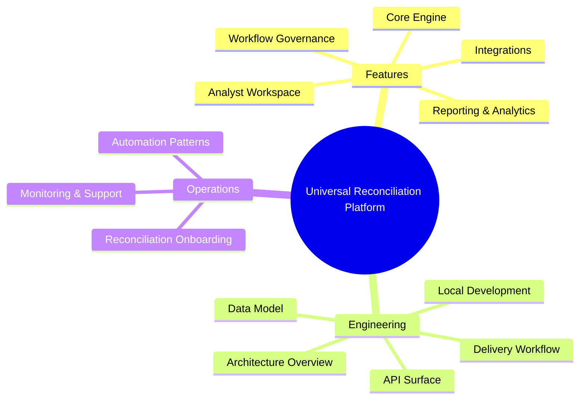

# Universal Reconciliation Platform Wiki

Welcome to the central knowledge base for the Universal Reconciliation Platform. This wiki consolidates every guide, reference, and playbook required to understand, operate, and extend the system.

## Quick Navigation
- [Feature Compendium](features.md) – Explore functional capabilities from executive highlights to low-level behaviors.
- [Developer Guide](developer-guide.md) – Understand architecture, code organization, API contracts, and workflows for contributing safely.
- [Reconciliation Onboarding Playbook](onboarding-guide.md) – Follow a production-ready checklist and walkthrough for onboarding new reconciliations with automation and reporting.
- [Project Bootstrap Charter](../Bootstrap.md) – Review the original project vision, phased rollout, and technology mandates.

## How to Use This Wiki
1. **Start with the Feature Compendium** to align stakeholders on what the platform delivers today.
2. **Deep dive into the Developer Guide** when designing or modifying services, UI flows, or infrastructure.
3. **Execute the Onboarding Playbook** whenever a new reconciliation, report schedule, or automation is required.
4. **Cross-reference Mermaid diagrams** embedded throughout the wiki for system architecture, data flow, and workflow context.

> **Tip:** All documentation uses relative links so you can clone the repository and browse the wiki offline.
