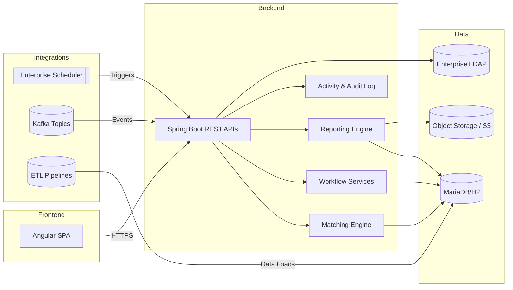
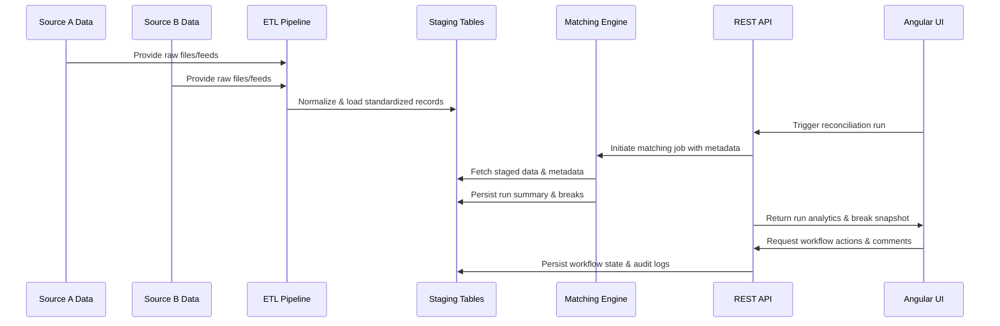
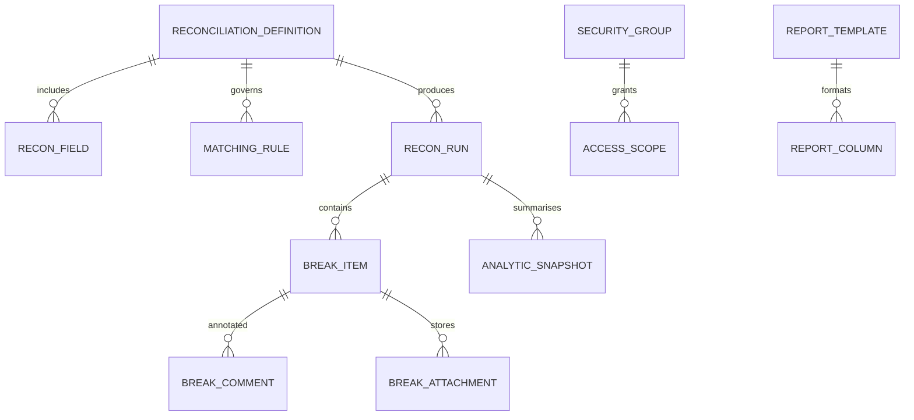
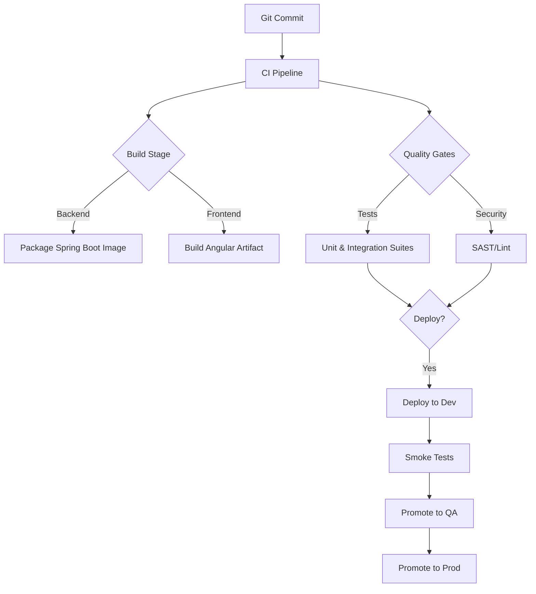

# Developer Guide

This guide is the canonical reference for engineers who build and operate the Universal Reconciliation Platform. It covers architecture, tooling, development workflows, and the contracts that bind the platform together.

## 1. Executive Summary
- **Project purpose:** Deliver a configurable reconciliation service that automates data matching, workflow governance, and reporting for financial operations teams.
- **Main technologies:** Spring Boot (Java 17), Angular 17, MariaDB (H2 for development), Kafka (optional), LDAP-backed identity.
- **Key features:** Metadata-driven reconciliations, maker-checker workflow, analytics dashboards, extensible API surface, configurable reporting and scheduled distribution.

## 2. Project Architecture

### 2.1 High-Level Overview


### 2.2 Key Components
- **Angular SPA:** Presents dashboards, run controls, break management, and reporting interfaces. Communicates with the backend via secured REST APIs.
- **Spring Boot services:** Expose endpoints, orchestrate matching runs, manage workflow state, and generate exports.
- **Matching engine:** Executes metadata-driven comparisons across staged data sets and writes run outcomes.
- **Workflow services:** Handle maker/checker transitions, comments, attachments, and audit logging.
- **Reporting engine:** Builds Excel outputs from database templates and supports scheduled delivery jobs.
- **Activity service:** Streams structured events for observability, compliance, and analytics.

### 2.3 Design Patterns Used
- **Hexagonal architecture:** Controllers adapt HTTP requests into service calls; services remain domain-focused and persistence-agnostic.
- **Configuration over code:** Reconciliation behaviors and UI presentations are driven by metadata stored in the database.
- **Event sourcing lite:** Activity feed persists immutable events for each significant action.
- **Dependency injection:** Spring and Angular rely on constructor injection for explicit dependency management and testability.

### 2.4 Data Flow


## 3. Setup & Installation

### 3.1 Prerequisites
- JDK 17+
- Maven 3.9+
- Node.js 18+ and npm 9+
- Docker Desktop (optional for containerized MariaDB/LDAP)
- Access to corporate LDAP (or demo profile configuration)

### 3.2 Environment Setup
1. Clone the repository and `cd` into `recon-platform`.
2. Bootstrap backend dependencies:
   ```bash
   cd backend
   ./mvnw dependency:go-offline
   cd ..
   ```
3. Install frontend dependencies:
   ```bash
   cd frontend
   npm install
   cd ..
   ```
4. Copy sample environment files if overrides are needed:
   - `backend/src/main/resources/application-dev.yml` → `application-local.yml`
   - `frontend/src/environments/environment.example.ts` → `environment.ts`
5. Ensure MariaDB (or H2) credentials match the Spring profile you intend to run.

### 3.3 Configuration Profiles
| Profile | Description | Command |
| --- | --- | --- |
| `dev` | Default local profile using H2 and seeded demo data. | `./mvnw spring-boot:run -Dspring-boot.run.profiles=dev` |
| `local-mariadb` | Connects to a local MariaDB instance while retaining demo ETL pipelines. | `./mvnw spring-boot:run -Dspring-boot.run.profiles=local-mariadb` |
| `prod` | Hardened configuration with external MariaDB, LDAP, and Kafka integrations. | `java -jar backend.jar --spring.profiles.active=prod` |

## 4. Code Organization

### 4.1 Directory Structure
| Path | Purpose |
| --- | --- |
| `backend/src/main/java` | Spring Boot application, controllers, services, domain model, repositories. |
| `backend/src/main/resources` | Configuration files, Liquibase migrations, application properties. |
| `backend/src/test/java` | Unit and integration tests with Spring Boot Test. |
| `frontend/src/app` | Angular standalone components, services, and routing. |
| `frontend/src/environments` | Environment-specific configuration files. |
| `docs/wiki` | Centralized wiki with feature, developer, and onboarding guides. |
| `docs/Bootstrap.md` | Historical project charter and phased rollout notes. |

### 4.2 Key Files
- `UniversalReconciliationPlatformApplication.java` – Application entry point and bootstrap configuration.
- `ReconciliationController.java` – REST surface for listing reconciliations, triggering runs, and retrieving analytics.
- `BreakController.java` – Manages break lifecycle, comments, attachments, and bulk updates.
- `ReportController.java` – Handles ad-hoc and scheduled exports.
- `ReconciliationStateService.ts` – Angular service managing global reconciliation state.
- `ApiService.ts` – Angular wrapper around backend REST endpoints with typed request/response contracts.

### 4.3 Important Modules
- **Matching module:** contains comparison strategies, tolerance calculators, and run orchestration services.
- **Workflow module:** encapsulates maker/checker logic, comment storage, and notification hooks.
- **Reporting module:** builds Excel templates using Apache POI and schedules report jobs via Spring Scheduling.
- **Security module:** integrates LDAP, JWT token issuance, and request-level authorization filters.

## 5. Core Concepts

### 5.1 Domain Models


### 5.2 Key Interfaces
- `MatchingRuleEvaluator` – Strategy interface for comparing staged records.
- `ReconciliationService` – Primary domain service orchestrating runs and analytics.
- `WorkflowService` – Manages break state transitions and audit logging.
- `ReportScheduler` – Coordinates cron-based report generation and distribution.
- `ActivityPublisher` – Emits structured events to activity feeds and external observability sinks.

### 5.3 Application Properties
| Property | Purpose | Example |
| --- | --- | --- |
| `recon.matching.maxThreads` | Controls thread pool size for matching jobs. | `8` |
| `recon.reporting.storage-root` | Filesystem or S3 path where generated reports are persisted. | `s3://recon-prod/reports` |
| `recon.activity.kafka-topic` | Kafka topic used for publishing activity events (optional). | `recon.activity.events` |
| `spring.ldap.urls` | LDAP connection string. | `ldaps://ldap.internal:636` |
| `spring.datasource.url` | JDBC connection for MariaDB/H2. | `jdbc:mariadb://localhost:3306/recon` |

## 6. Development Workflow

### 6.1 Building
- **Backend:** `cd backend && ./mvnw clean package`
- **Frontend:** `cd frontend && npm run build`

### 6.2 Testing
- **Backend unit/integration tests:** `cd backend && ./mvnw test`
- **Frontend tests:** `cd frontend && npm test -- --watch=false --browsers=ChromeHeadless`
- **Linting (optional but recommended):** `cd frontend && npm run lint`

### 6.3 Running Locally
1. Start the backend: `cd backend && ./mvnw spring-boot:run`
2. In a separate terminal start the frontend: `cd frontend && npm start`
3. Navigate to `http://localhost:4200` and sign in with demo credentials (any username/password for dev profile).

### 6.4 Deployment Pipeline


## 7. API Reference

### 7.1 Authentication
| Endpoint | Method | Description |
| --- | --- | --- |
| `/api/auth/login` | POST | Authenticate via LDAP credentials and receive JWT session token. |
| `/api/auth/refresh` | POST | Issue a fresh JWT using a valid refresh token. |

### 7.2 Reconciliations
| Endpoint | Method | Description |
| --- | --- | --- |
| `/api/reconciliations` | GET | List accessible reconciliation definitions. |
| `/api/reconciliations/{id}` | GET | Retrieve metadata, matching rules, and configuration details. |
| `/api/reconciliations/{id}/runs` | POST | Trigger a reconciliation run with optional parameters (trigger type, correlation ID). |
| `/api/reconciliations/{id}/runs/latest` | GET | Fetch analytics summary and break snapshot for the latest run. |

### 7.3 Break Management
| Endpoint | Method | Description |
| --- | --- | --- |
| `/api/breaks` | GET | Filter breaks by reconciliation, status, product, or entity. |
| `/api/breaks/{breakId}` | GET | Retrieve detailed break data including source A/B comparison. |
| `/api/breaks/{breakId}/comments` | POST | Add a comment or attachment to a break. |
| `/api/breaks/{breakId}/status` | PUT | Transition break status (Open → Pending → Closed). |
| `/api/breaks/bulk-actions` | POST | Perform bulk status updates and annotations. |

### 7.4 Reporting & Activity
| Endpoint | Method | Description |
| --- | --- | --- |
| `/api/reports` | POST | Generate an ad-hoc report for a reconciliation run. |
| `/api/reports/schedules` | GET | List configured report schedules. |
| `/api/reports/schedules` | POST | Create or update a scheduled report with recipients and cadence. |
| `/api/activity` | GET | Stream activity feed entries filtered by reconciliation or event type. |

## 8. Common Tasks

### 8.1 Adding a New Matching Rule
1. Extend `MatchingRuleEvaluator` with the new comparison logic.
2. Register the evaluator in the matching module configuration.
3. Add metadata to `MATCHING_RULE` for the reconciliation definition via API or admin UI.
4. Update unit tests and documentation.

### 8.2 Creating a Scheduled Report
1. Define a `REPORT_TEMPLATE` and related columns.
2. Configure recipients and cadence via `/api/reports/schedules`.
3. Verify delivery in lower environment; ensure storage root is reachable.
4. Document the schedule in `docs/wiki/onboarding-guide.md` for operational awareness.

### 8.3 Debugging ETL Issues
1. Run backend with `--spring.profiles.active=dev` to trigger sample ETL pipelines.
2. Inspect logs for `SampleEtlRunner` output to verify pipelines executed.
3. Validate data presence in staging tables (`recon_source_a`, `recon_source_b`).
4. Re-run ETL pipeline class manually using `@Component` test harness if needed.

### 8.4 Troubleshooting Authentication
- Confirm LDAP connection properties in `application-*.yml` are correct.
- Use the `/api/auth/health` endpoint (if enabled) to validate LDAP reachability.
- For local development, enable the demo authentication profile to bypass LDAP while maintaining maker/checker flows.

## 9. References
- [Feature Compendium](features.md)
- [Reconciliation Onboarding Playbook](onboarding-guide.md)
- [Project Bootstrap Charter](../Bootstrap.md)
