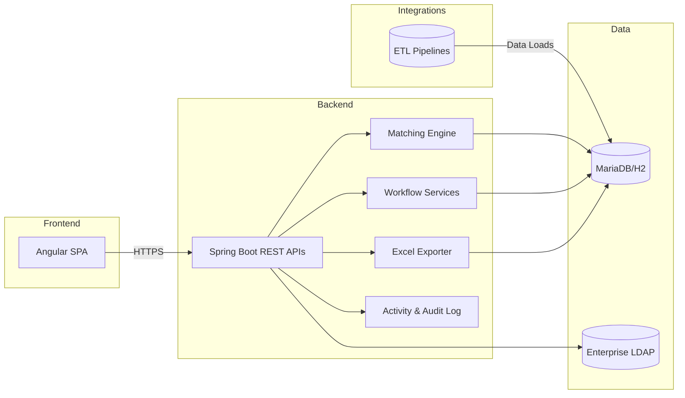
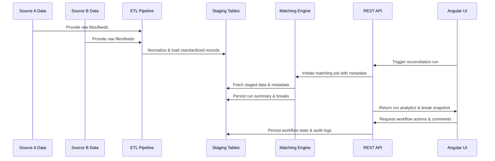
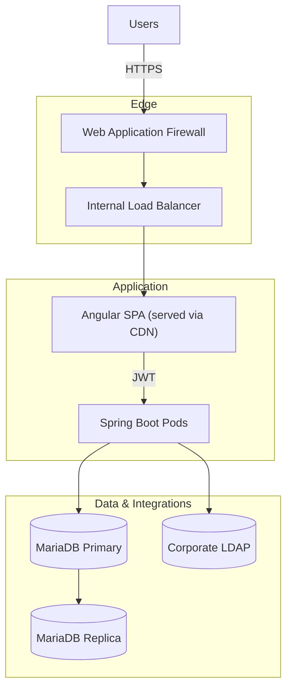
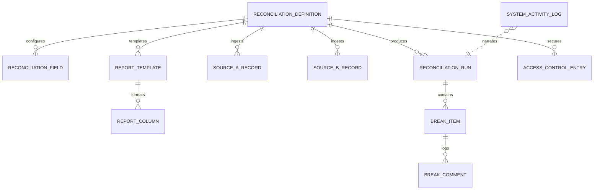
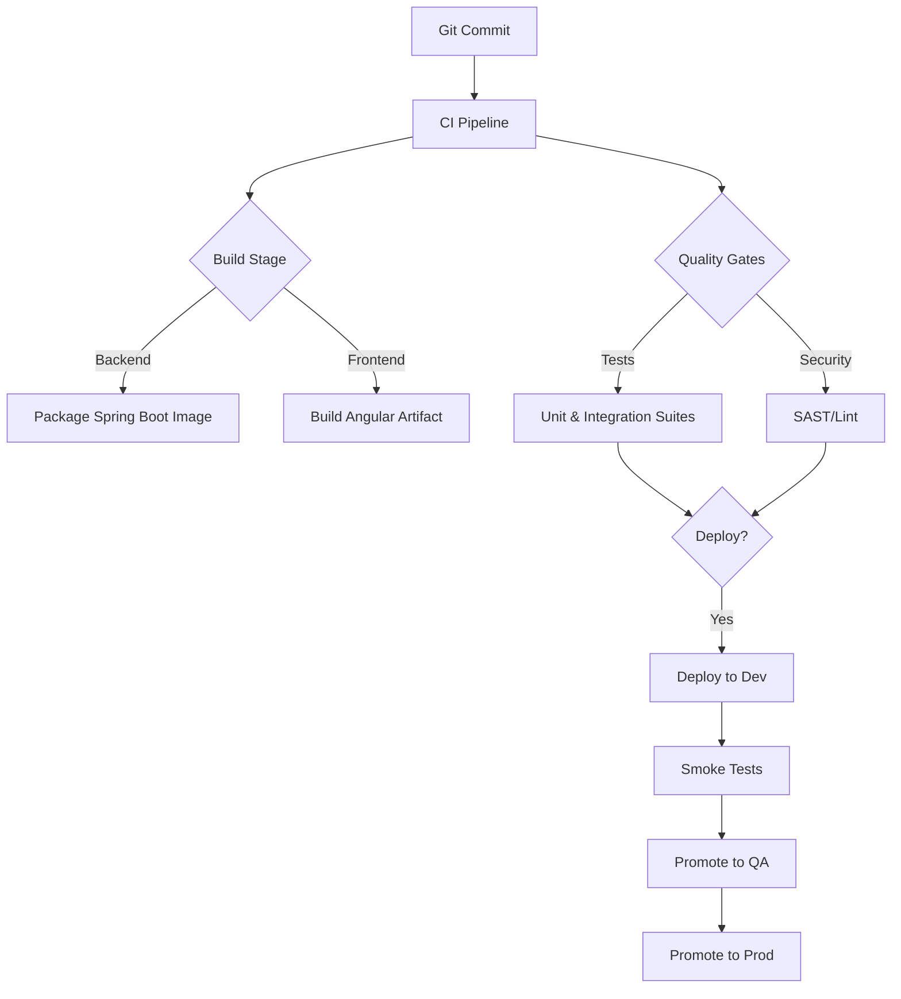

# Developer Guide

This guide is the canonical reference for engineers who build and operate the Universal Reconciliation Platform. It covers architecture, tooling, development workflows, and the contracts that bind the platform together.

## 1. Executive Summary
- **Project purpose:** Deliver a configurable reconciliation service that automates data matching, workflow governance, and reporting for financial operations teams.
- **Main technologies:** Spring Boot (Java 17), Angular 17, MariaDB (H2 for development), embedded LDAP for local auth.
- **Key features:** Metadata-driven reconciliations, maker-checker workflow, analytics dashboards, extensible API surface, on-demand Excel exports.

## 2. Project Architecture

### 2.1 High-Level Overview


### 2.2 Key Components
- **Angular SPA:** Presents dashboards, run controls, break management, and reporting interfaces. Communicates with the backend via secured REST APIs.
- **Spring Boot services:** Expose endpoints, orchestrate matching runs, manage workflow state, and generate exports.
- **Matching engine:** Executes metadata-driven comparisons across staged data sets and writes run outcomes.
- **Workflow services:** Handle maker/checker transitions, comments, and audit logging.
- **Reporting engine:** Builds Excel outputs from database templates and exposes download endpoints via `/api/exports`.
- **Activity service:** Streams structured events for observability, compliance, and analytics.

### 2.3 Design Patterns Used
- **Hexagonal architecture:** Controllers adapt HTTP requests into service calls; services remain domain-focused and persistence-agnostic.
- **Configuration over code:** Reconciliation behaviors and UI presentations are driven by metadata stored in the database.
- **Event sourcing lite:** Activity feed persists immutable events for each significant action.
- **Dependency injection:** Spring and Angular rely on constructor injection for explicit dependency management and testability.

### 2.4 Data Flow


### 2.5 Deployment Topology
The platform is typically deployed across three tiers to isolate user traffic, service execution, and persistent data.



**Deployment notes**
- Angular assets are served via CDN/edge caching while API calls terminate at the internal load balancer.
- Stateful services (MariaDB) reside on a protected subnet with automated backups and read replicas for analytics.

## 3. Setup & Installation

### 3.1 Prerequisites
- JDK 17+
- Maven 3.9+
- Node.js 18+ and npm 9+
- Docker Desktop (optional for containerized MariaDB/LDAP)
- Access to corporate LDAP (or demo profile configuration)

### 3.2 Environment Setup
1. Clone the repository and `cd` into `recon-platform`.
2. Bootstrap backend dependencies:
   ```bash
   cd backend
   ./mvnw dependency:go-offline
   cd ..
   ```
3. Install frontend dependencies:
   ```bash
   cd frontend
   npm install
   cd ..
   ```
4. Create override files if environment-specific settings are required:
   - Duplicate `backend/src/main/resources/application.yml` to `application-local.yml` and adjust the datasource URL or LDAP bases.
   - Update `frontend/src/environments/environment.ts` with the correct `apiBaseUrl` for your backend instance.
5. Ensure MariaDB (or H2) credentials match the Spring profile you intend to run.

### 3.3 Configuration Profiles
| Profile | Description | Command |
| --- | --- | --- |
| `dev` | Default local profile using H2 and seeded demo data. | `./mvnw spring-boot:run -Dspring-boot.run.profiles=dev` |
| `local-mariadb` | Connects to a local MariaDB instance while retaining demo ETL pipelines. | `./mvnw spring-boot:run -Dspring-boot.run.profiles=local-mariadb` |
| `prod` | Hardened configuration with external MariaDB and enterprise LDAP integrations. | `java -jar backend.jar --spring.profiles.active=prod` |

### 3.4 Data Seeding & Sample Jobs
- **Schema creation:** `spring.jpa.hibernate.ddl-auto=update` creates or updates tables automatically for development profiles. For a clean rebuild, start H2 with `-Dspring.jpa.hibernate.ddl-auto=create` once and revert to `update` afterward.
- **Sample ETL:** `EtlBootstrapper` inspects the Spring context for any `EtlPipeline` beans (including those packaged inside example modules) and executes them during application startup. This keeps the platform agnostic of which reconciliations are present while still seeding demo data.
- **Refreshing data:** Restarting the backend clears the in-memory H2 database. For MariaDB, run `DELETE FROM source_a_records`, `source_b_records`, and `break_items` before rerunning the application so the pipelines can repopulate data.
- **User identities:** `ldap-data.ldif` seeds demo users and groups when using the embedded LDAP server. Update this file or point Spring LDAP to an external directory for enterprise integration.

## 4. Code Organization

### 4.1 Directory Structure
| Path | Purpose |
| --- | --- |
| `backend/src/main/java` | Spring Boot application, controllers, services, domain model, repositories. |
| `backend/src/main/resources` | Configuration files, ETL fixtures, application properties, and embedded LDAP data. |
| `backend/src/test/java` | Unit and integration tests with Spring Boot Test. |
| `frontend/src/app` | Angular standalone components, services, and routing. |
| `frontend/src/environments` | Environment-specific configuration files. |
| `docs/wiki` | Centralized wiki with feature, developer, and onboarding guides. |
| `docs/Bootstrap.md` | Historical project charter and phased rollout notes. |

### 4.2 Key Files
- `UniversalReconciliationPlatformApplication.java` – Application entry point and bootstrap configuration.
- `ReconciliationController.java` – REST surface for listing reconciliations, triggering runs, and retrieving analytics.
- `BreakController.java` – Manages break lifecycle, comments, status transitions, and bulk updates.
- `ExportController.java` – Streams Excel exports and records activity events when users download reports.
- `SystemActivityController.java` – Exposes the activity feed consumed by the dashboard timeline.
- `EtlBootstrapper.java` – Executes every available `EtlPipeline` bean so the platform and standalone examples can seed data without code changes.
- `examples/common` – Shared support library for example ETL pipelines (dataset readers, helper abstractions).
- `examples/<module>` – Standalone reconciliation examples (cash-vs-gl, securities-position, custodian-trade) with dedicated Spring Boot applications, resources, and end-to-end tests.
- `ReconciliationStateService.ts` – Angular service managing global reconciliation state.
- `api.service.ts` – Angular wrapper around backend REST endpoints with typed request/response contracts.

### 4.3 Important Modules
- **Matching module (`service/matching`):** `MatchingEngine` interface with `ExactMatchingEngine` implementation that evaluates configured reconciliation fields and produces `MatchingResult` aggregates.
- **Break management (`service/BreakService`, `BreakAccessService`):** Applies maker/checker rules, enforces security scopes, and persists comments or status updates.
- **Analytics (`service/RunAnalyticsCalculator`):** Computes chart-ready aggregations for the dashboard, including break counts by status, type, product, and age buckets.
- **Exporting (`service/ExportService`):** Generates XLSX workbooks from run results and tracks download activity through `SystemActivityService`.
- **Security (`config/SecurityConfig`, `security/*`):** Configures Spring Security with LDAP authentication, JWT issuance/validation, and per-request user context resolution.
- **ETL pipelines (`etl/*`):** Normalise raw CSV fixtures into `source_a_records`/`source_b_records` tables to simulate upstream feeds in non-production environments.

### 4.4 Standalone Example Library
- **Location:** The `examples/` directory contains Maven modules that package full-stack reference implementations. Each module includes its own Spring Boot application, ETL pipeline, resources, documentation, and an end-to-end integration test invoked through `scripts/run_e2e.sh`.
- **Isolation:** Example modules depend on the shared `examples/common` library but remain decoupled from the main platform packaging so teams can copy/paste or fork them independently.
- **Data assets:** To avoid committing binary workbooks, Excel fixtures are stored as Base64 text files with the suffix `.xlsx.b64`. `AbstractExampleEtlPipeline#readExcel` transparently decodes these files at runtime, preserving the Excel ingestion behaviour while keeping the repository diff-friendly.
- **Extensibility:** New reconciliations can be prototyped by duplicating an example module, updating its `pom.xml` coordinates, and contributing an `EtlPipeline` bean. The platform will automatically execute it via `EtlBootstrapper` when the application starts.

## 5. Core Concepts

### 5.1 Domain Models


### 5.2 Key Interfaces & Services
- `MatchingEngine` – Abstraction for executing the matching algorithm; implemented by `ExactMatchingEngine`.
- `ReconciliationService` – Coordinates entitlement checks, invokes the matching engine, persists runs, and assembles `RunDetailDto` responses.
- `BreakService` – Applies maker/checker rules, updates break status, and appends comments through transactional operations.
- `BreakAccessService` – Filters breaks and reconciliations based on LDAP group entitlements and optional dimensional restrictions.
- `RunAnalyticsCalculator` – Aggregates break data into charts consumed by the Angular dashboard.
- `ExportService` – Generates Excel exports leveraging Apache POI and the configured report templates.
- `SystemActivityService` – Persists audit events (`SystemEventType`) and exposes them to the `/api/activity` endpoint.
- `UserContext` – Lightweight wrapper around Spring Security providing current username and group memberships for downstream services.

### 5.3 Application Properties
| Property | Purpose | Example |
| --- | --- | --- |
| `spring.datasource.url` | JDBC connection string; defaults to in-memory H2 for local development. | `jdbc:mariadb://localhost:3306/recon` |
| `spring.jpa.hibernate.ddl-auto` | Controls schema management strategy (`update` in dev, `validate` in prod). | `update` |
| `app.security.jwt.secret` | Symmetric key used to sign JWTs; set via environment variable in every environment. | `change-me-super-secret` |
| `app.security.jwt.expiration-seconds` | Token lifetime expressed in seconds. | `86400` |
| `app.security.ldap.people-base` | LDAP base DN for users; override when binding to enterprise directories. | `ou=people,dc=corp,dc=example` |
| `app.security.cors.allowed-origins[0]` | Allowed frontend origins for browser requests. | `http://localhost:4200` |
| `logging.level.com.universal.reconciliation` | Fine-tunes logging verbosity for application packages. | `DEBUG` |

### 5.4 Database Schema Reference
The reconciliation service persists metadata, operational results, and workflow artefacts in MariaDB. The tables below list the most frequently touched entities along with their key columns.

#### Table: `reconciliation_definitions`
| Column | Type | Nullable | Notes |
| --- | --- | --- | --- |
| `id` | BIGINT (PK) | No | Auto-increment primary key. |
| `code` | VARCHAR(64) | No | Human-friendly unique identifier used by APIs and UI routes. |
| `name` | VARCHAR(128) | No | Display label shown to end users. |
| `description` | VARCHAR(512) | No | Business context and scope of the reconciliation. |
| `maker_checker_enabled` | BOOLEAN | No | Enables dual-approval workflow when `true`. |

#### Table: `reconciliation_fields`
| Column | Type | Nullable | Notes |
| --- | --- | --- | --- |
| `id` | BIGINT (PK) | No | Auto-increment primary key. |
| `definition_id` | BIGINT (FK) | No | References `reconciliation_definitions.id`. Indexed for fast joins. |
| `source_field` | VARCHAR(128) | No | Raw column identifier from source feeds. |
| `display_name` | VARCHAR(128) | No | Friendly label rendered in the UI and reports. |
| `role` | ENUM(`KEY`,`COMPARE`,`DISPLAY`,`PRODUCT`,`SUB_PRODUCT`,`ENTITY`) | No | Drives grouping, matching, or descriptive behavior. |
| `data_type` | ENUM(`STRING`,`DECIMAL`,`INTEGER`,`DATE`) | No | Controls parsing and tolerance rules. |
| `comparison_logic` | ENUM(`EXACT_MATCH`,`CASE_INSENSITIVE`,`NUMERIC_THRESHOLD`,`DATE_ONLY`) | No | Names the evaluator strategy applied during matching. |
| `threshold_percentage` | DECIMAL(5,2) | Yes | Optional tolerance applied by numeric comparison strategies. |

#### Table: `reconciliation_runs`
| Column | Type | Nullable | Notes |
| --- | --- | --- | --- |
| `id` | BIGINT (PK) | No | Auto-increment primary key. |
| `definition_id` | BIGINT (FK) | No | References `reconciliation_definitions.id`. |
| `run_date_time` | TIMESTAMP | No | Execution start time. |
| `trigger_type` | ENUM(`MANUAL_API`,`SCHEDULED_CRON`,`EXTERNAL_API`,`KAFKA_EVENT`) | No | Origin of the run. |
| `status` | ENUM(`SUCCESS`,`FAILED`) | No | Aggregated lifecycle state. |
| `triggered_by` | VARCHAR(128) | Yes | User DN or service principal. |
| `trigger_comments` | VARCHAR(512) | Yes | Operator-supplied context. |
| `trigger_correlation_id` | VARCHAR(64) | Yes | External reference for tracking (e.g., job ID). |
| `matched_count` | INT | No | Number of records matched in the run. |
| `mismatched_count` | INT | No | Number of breaks created due to mismatches. |
| `missing_count` | INT | No | Number of missing records detected. |

#### Table: `break_items`
| Column | Type | Nullable | Notes |
| --- | --- | --- | --- |
| `id` | BIGINT (PK) | No | Auto-increment primary key. |
| `run_id` | BIGINT (FK) | No | References `reconciliation_runs.id`. |
| `break_type` | ENUM(`MISMATCH`,`MISSING_IN_SOURCE_A`,`MISSING_IN_SOURCE_B`) | No | Source of discrepancy. |
| `status` | ENUM(`OPEN`,`PENDING_APPROVAL`,`CLOSED`) | No | Workflow state; updated by maker/checker transitions. |
| `product` | VARCHAR(64) | Yes | Optional classification dimension. |
| `sub_product` | VARCHAR(64) | Yes | Secondary classification. |
| `entity_name` | VARCHAR(128) | Yes | Legal entity or fund name. |
| `detected_at` | TIMESTAMP | No | Time the break was generated. |
| `source_a_json` | CLOB | Yes | Serialized source A payload used for audit and drill-down. |
| `source_b_json` | CLOB | Yes | Serialized source B payload used for audit and drill-down. |

#### Table: `break_comments`
| Column | Type | Nullable | Notes |
| --- | --- | --- | --- |
| `id` | BIGINT (PK) | No | Auto-increment primary key. |
| `break_item_id` | BIGINT (FK) | No | References `break_items.id`. |
| `actor_dn` | VARCHAR(256) | No | LDAP distinguished name of the actor. |
| `action` | VARCHAR(64) | No | Action code (e.g., `COMMENT`, `ASSIGN`, `CLOSE`). |
| `comment` | VARCHAR(2000) | No | Free-form text content. |
| `created_at` | TIMESTAMP | No | Audit timestamp in UTC. |

#### Table: `report_templates`
| Column | Type | Nullable | Notes |
| --- | --- | --- | --- |
| `id` | BIGINT (PK) | No | Auto-increment primary key. |
| `definition_id` | BIGINT (FK) | No | References `reconciliation_definitions.id`. |
| `name` | VARCHAR(128) | No | Template label shown to users. |
| `description` | VARCHAR(256) | No | Business usage description. |
| `include_matched` | BOOLEAN | No | Include matched records when `true`. |
| `include_mismatched` | BOOLEAN | No | Include mismatched records when `true`. |
| `include_missing` | BOOLEAN | No | Include missing records when `true`. |
| `highlight_differences` | BOOLEAN | No | Toggle for conditional formatting. |

#### Table: `report_columns`
| Column | Type | Nullable | Notes |
| --- | --- | --- | --- |
| `id` | BIGINT (PK) | No | Auto-increment primary key. |
| `template_id` | BIGINT (FK) | No | References `report_templates.id`. |
| `header` | VARCHAR(128) | No | Column header text. |
| `source` | ENUM(`SOURCE_A`,`SOURCE_B`,`BREAK_METADATA`) | No | Determines the data source for the column value. |
| `source_field` | VARCHAR(128) | Yes | Field key when sourcing from A/B datasets. |
| `display_order` | INT | No | Zero-based ordering for Excel generation. |
| `highlight_differences` | BOOLEAN | No | Overrides template-level highlight if necessary. |

#### Table: `access_control_entries`
| Column | Type | Nullable | Notes |
| --- | --- | --- | --- |
| `id` | BIGINT (PK) | No | Auto-increment primary key. |
| `ldap_group_dn` | VARCHAR(256) | No | Group distinguished name mapped from LDAP. |
| `definition_id` | BIGINT (FK) | No | References `reconciliation_definitions.id`. |
| `product` | VARCHAR(64) | Yes | Optional dimension filter for entitlements. |
| `sub_product` | VARCHAR(64) | Yes | Optional secondary dimension filter. |
| `entity_name` | VARCHAR(128) | Yes | Optional legal entity filter. |
| `role` | ENUM(`VIEWER`,`MAKER`,`CHECKER`) | No | Determines UI capabilities and API scopes. |

#### Table: `source_a_records` & `source_b_records`
| Column | Type | Nullable | Notes |
| --- | --- | --- | --- |
| `id` | BIGINT (PK) | No | Auto-increment primary key. |
| `definition_id` | BIGINT (FK) | No | References `reconciliation_definitions.id`. |
| `transaction_id` | VARCHAR(64) | No | Unique identifier used for pairing records. |
| `amount` | DECIMAL(19,4) | No | Monetary amount normalized to base precision. |
| `currency` | VARCHAR(3) | No | ISO-4217 currency code. |
| `trade_date` | DATE | No | Transaction execution date. |
| `product` | VARCHAR(64) | No | Product family, used for access scoping. |
| `sub_product` | VARCHAR(64) | No | Product subtype. |
| `entity_name` | VARCHAR(128) | No | Legal entity or fund. |
| `account_id` | VARCHAR(64) | Yes | External account identifier. |
| `isin` | VARCHAR(12) | Yes | Security identifier if applicable. |
| `quantity` | DECIMAL(19,4) | Yes | Trade quantity. |
| `market_value` | DECIMAL(19,4) | Yes | Valuation amount. |
| `valuation_currency` | VARCHAR(3) | Yes | Currency of the valuation. |
| `valuation_date` | DATE | Yes | Date of valuation snapshot. |
| `custodian` | VARCHAR(128) | Yes | Holding custodian. |
| `portfolio_manager` | VARCHAR(128) | Yes | Responsible manager, used for workflow routing. |

#### Table: `system_activity_logs`
| Column | Type | Nullable | Notes |
| --- | --- | --- | --- |
| `id` | BIGINT (PK) | No | Auto-increment primary key. |
| `event_type` | ENUM(`RECONCILIATION_RUN`,`BREAK_STATUS_CHANGE`,`BREAK_COMMENT`,`BREAK_BULK_ACTION`,`REPORT_EXPORT`) | No | Categorizes the event for filtering. |
| `details` | VARCHAR(2000) | No | Human-readable summary or JSON payload. |
| `recorded_at` | TIMESTAMP | No | Event time captured in UTC. |

> ℹ️ **Indexing guidance:** Create composite indexes on `(definition_id, product, sub_product)` for break and access tables to accelerate entitlement filtering. When using JPA auto-DDL, apply these indexes manually in production databases to preserve query performance.

## 6. Development Workflow

### 6.1 Building
- **Backend:** `cd backend && ./mvnw clean package`
- **Frontend:** `cd frontend && npm run build`

### 6.2 Testing
- **Backend unit/integration tests:** `cd backend && ./mvnw test`
- **Frontend tests:** `cd frontend && npm test -- --watch=false --browsers=ChromeHeadless`
- **Linting (optional but recommended):** `cd frontend && npm run lint`

### 6.3 Running Locally
1. Start the backend: `cd backend && ./mvnw spring-boot:run`
2. In a separate terminal start the frontend: `cd frontend && npm start`
3. Navigate to `http://localhost:4200` and sign in with demo credentials (any username/password for dev profile).

### 6.4 Deployment Pipeline


## 7. API Reference

All endpoints (except `/api/auth/login`) require a JWT bearer token obtained during login. The Angular SPA forwards the token via the `Authorization: Bearer <token>` header for every request.

### 7.1 Authentication
| Endpoint | Method | Description |
| --- | --- | --- |
| `/api/auth/login` | POST | Authenticate against LDAP and receive a signed JWT plus group entitlements. |

**Sample: Login**

_Request_
```http
POST /api/auth/login HTTP/1.1
Content-Type: application/json

{
  "username": "analyst.jane",
  "password": "Sup3rSecret!"
}
```

_Response `200 OK`_
```json
{
  "token": "eyJhbGciOiJIUzI1NiIsInR5cCI6IkpXVCJ9...",
  "displayName": "Jane Analyst",
  "groups": [
    "CN=RECON_PREPARERS,OU=Groups,DC=corp,DC=example",
    "CN=RECON_APPROVERS,OU=Groups,DC=corp,DC=example"
  ]
}
```

### 7.2 Reconciliations
| Endpoint | Method | Description |
| --- | --- | --- |
| `/api/reconciliations` | GET | Return reconciliations visible to the caller based on LDAP group membership. |
| `/api/reconciliations/{id}/run` | POST | Trigger the matching engine for the specified reconciliation definition. |
| `/api/reconciliations/{id}/runs/latest` | GET | Fetch the latest completed run plus optional break filters (`product`, `subProduct`, `entity`, `status`). |
| `/api/reconciliations/runs/{runId}` | GET | Retrieve any historical run by identifier, with the same filter parameters as `runs/latest`. |

**Sample: List reconciliations**

_Response `200 OK`_
```json
[
  {
    "id": 42,
    "code": "SECURITY_POSITIONS",
    "name": "Security Position Reconciliation",
    "description": "Compares custody holdings against internal positions"
  },
  {
    "id": 77,
    "code": "CASH_BALANCES",
    "name": "Cash Nostro Reconciliation",
    "description": "Matches nostro balances to the general ledger"
  }
]
```

**Sample: Trigger a run**

_Request_
```http
POST /api/reconciliations/42/run HTTP/1.1
Content-Type: application/json
Authorization: Bearer <token>

{
  "triggerType": "MANUAL_API",
  "correlationId": "OPS-2024-09-15-001",
  "comments": "Month-end validation",
  "initiatedBy": "analyst.jane"
}
```

_Response `200 OK`_
```json
{
  "summary": {
    "definitionId": 42,
    "runId": 915,
    "runDateTime": "2024-09-15T21:05:17Z",
    "triggerType": "MANUAL_API",
    "triggeredBy": "analyst.jane",
    "triggerCorrelationId": "OPS-2024-09-15-001",
    "triggerComments": "Month-end validation",
    "matched": 15892,
    "mismatched": 37,
    "missing": 4
  },
  "analytics": {
    "breaksByStatus": {"OPEN": 29, "PENDING_APPROVAL": 8},
    "breaksByType": {"MISMATCH": 33, "MISSING_IN_SOURCE_A": 4},
    "breaksByProduct": {"EQUITIES": 19, "FIXED_INCOME": 18},
    "breaksByEntity": {"Fund-01": 12, "Fund-02": 25},
    "openBreaksByAgeBucket": {"<1d": 21, "1-3d": 8},
    "filteredBreakCount": 37,
    "totalBreakCount": 37,
    "totalMatchedCount": 15892
  },
  "breaks": [
    {
      "id": 5012,
      "breakType": "MISMATCH",
      "status": "OPEN",
      "product": "EQUITIES",
      "subProduct": "US LISTED",
      "entity": "Fund-01",
      "allowedStatusTransitions": ["PENDING_APPROVAL"],
      "detectedAt": "2024-09-15T21:05:18Z",
      "sourceA": {"transactionId": "TX-99321", "amount": 100000.0},
      "sourceB": {"transactionId": "TX-99321", "amount": 95000.0},
      "comments": []
    }
  ],
  "filters": {
    "products": ["EQUITIES", "FIXED_INCOME"],
    "subProducts": ["US LISTED", "CORPORATE"],
    "entities": ["Fund-01", "Fund-02"],
    "statuses": ["OPEN", "PENDING_APPROVAL", "CLOSED"]
  }
}
```

**Sample: Fetch latest run with filters**

_Request_
```http
GET /api/reconciliations/42/runs/latest?product=EQUITIES&status=OPEN&status=PENDING_APPROVAL HTTP/1.1
Authorization: Bearer <token>
```

_Response `200 OK`_: identical payload shape as the trigger response but scoped to filtered breaks only.

### 7.3 Break Management
| Endpoint | Method | Description |
| --- | --- | --- |
| `/api/breaks/{id}/comments` | POST | Append a timeline comment and optional action code to a break. |
| `/api/breaks/{id}/status` | PATCH | Transition a break to `PENDING_APPROVAL` or `CLOSED` (maker/checker enforced). |
| `/api/breaks/bulk` | POST | Apply a shared status change and/or comment to multiple breaks. |

**Sample: Comment on a break**

_Request_
```http
POST /api/breaks/5012/comments HTTP/1.1
Content-Type: application/json
Authorization: Bearer <token>

{
  "comment": "Investigated variance with custodian, awaiting approval",
  "action": "COMMENT"
}
```

_Response `200 OK`_
```json
{
  "id": 5012,
  "breakType": "MISMATCH",
  "status": "OPEN",
  "product": "EQUITIES",
  "subProduct": "US LISTED",
  "entity": "Fund-01",
  "allowedStatusTransitions": ["PENDING_APPROVAL"],
  "detectedAt": "2024-09-15T21:05:18Z",
  "sourceA": {"transactionId": "TX-99321", "amount": 100000.0},
  "sourceB": {"transactionId": "TX-99321", "amount": 95000.0},
  "comments": [
    {
      "id": 88291,
      "actorDn": "CN=analyst.jane,OU=Users,DC=corp,DC=example",
      "action": "COMMENT",
      "comment": "Investigated variance with custodian, awaiting approval",
      "createdAt": "2024-09-15T21:12:03Z"
    }
  ]
}
```

**Sample: Bulk transition**

_Request_
```http
POST /api/breaks/bulk HTTP/1.1
Content-Type: application/json
Authorization: Bearer <token>

{
  "breakIds": [5012, 5013, 5017],
  "status": "PENDING_APPROVAL",
  "comment": "Escalated for checker review",
  "action": "BULK_ESCALATE"
}
```

_Response `200 OK`_: returns an array of updated `BreakItemDto` objects mirroring the structure above.

### 7.4 Reporting & Activity
| Endpoint | Method | Description |
| --- | --- | --- |
| `/api/exports/runs/{runId}` | GET | Stream an Excel workbook for the specified run using the active report template. |
| `/api/activity` | GET | Retrieve the 50 most recent system activity entries visible to the caller. |

**Sample: Activity feed**

_Response `200 OK`_
```json
[
  {
    "id": 3391,
    "eventType": "RECONCILIATION_RUN",
    "details": "Run 915 completed successfully",
    "recordedAt": "2024-09-15T21:05:22Z"
  },
  {
    "id": 3392,
    "eventType": "BREAK_STATUS_CHANGE",
    "details": "Break 5012 moved to PENDING_APPROVAL by CN=analyst.jane,OU=Users,DC=corp,DC=example",
    "recordedAt": "2024-09-15T21:12:05Z"
  }
]
```

> 📄 **Excel exports:** The `/api/exports/runs/{runId}` endpoint streams binary content (`application/vnd.openxmlformats-officedocument.spreadsheetml.sheet`). Angular triggers it via `window.open` or `HttpClient` with `responseType: 'blob'` and prompts the user to download `reconciliation-run-<id>.xlsx`.

### 7.5 Error Handling & Status Codes
- **401 Unauthorized:** Returned when the JWT is missing, expired, or invalid.
- **403 Forbidden:** Raised when the authenticated user lacks the required LDAP group for the requested reconciliation or activity feed.
- **404 Not Found:** Emitted when a reconciliation, run, or break ID does not exist or is not visible to the caller.
- **422 Unprocessable Entity:** Validation failures on comment, status, or bulk update payloads (e.g., empty comment, missing work for bulk update).
- **500 Internal Server Error:** Unexpected exceptions are logged with correlation IDs; check the activity feed and application logs for context.

## 8. Common Tasks

### 8.1 Onboarding a New Reconciliation Definition
1. Insert a row into `reconciliation_definitions` with a unique `code`, descriptive `name`, and `maker_checker_enabled` flag.
2. Populate `reconciliation_fields` for the definition, marking at least one `KEY` and the desired `COMPARE` fields (specify `comparison_logic` and `threshold_percentage` where required).
3. Load or stream source data into `source_a_records` and `source_b_records` with matching `definition_id` values. Use the existing ETL pipeline classes as templates for ingestion.
4. Configure `access_control_entries` to map LDAP groups to the definition and optional product/entity slices.
5. Trigger the run via the UI or `POST /api/reconciliations/{id}/run`, then review analytics and breaks to confirm alignment.

### 8.2 Generating and Sharing an Excel Export
1. Trigger or locate a run using `GET /api/reconciliations/{id}/runs/latest`.
2. Download the workbook with `GET /api/exports/runs/{runId}` (supply the JWT in the `Authorization` header).
3. Store the binary response as `reconciliation-run-<runId>.xlsx` and distribute to stakeholders via secure channels.
4. Confirm the download was captured in the activity feed (`SystemEventType.REPORT_EXPORT`).

### 8.3 Debugging ETL Issues
1. Start the backend with the default profile; `SampleEtlRunner` logs each pipeline execution at INFO level.
2. Inspect the application console output (or configured log appender) for pipeline-specific errors (e.g., malformed CSV rows).
3. Query `source_a_records` and `source_b_records` to verify record counts and key fields; use the H2 console (`/h2-console`) in dev.
4. To rerun a single pipeline, autowire the component in a Spring test or temporary REST endpoint and call its `run()` method manually.

### 8.4 Troubleshooting Authentication
- Confirm LDAP settings in `application.yml`/`application-local.yml` (`app.security.ldap.*`, `spring.ldap.*`) align with your directory.
- When using embedded LDAP, update `ldap-data.ldif` to reflect desired demo users and groups.
- Enable DEBUG logging for `org.springframework.security` temporarily to trace bind attempts and JWT validation issues.

## 9. References
- [Feature Compendium](features.md)
- [Reconciliation Onboarding Playbook](onboarding-guide.md)
- [Project Bootstrap Charter](../Bootstrap.md)
