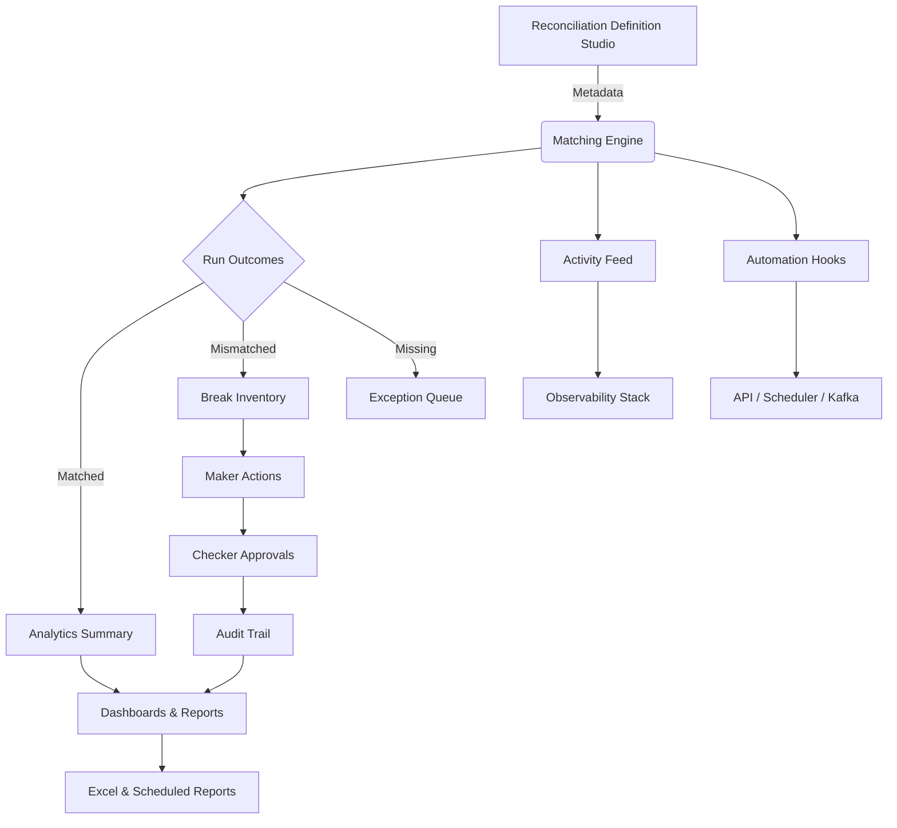
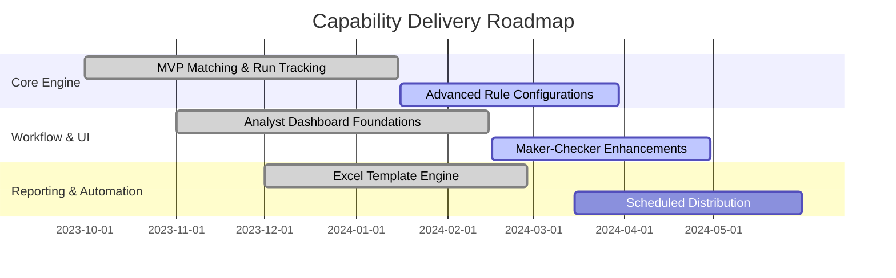

# Feature Compendium

This document enumerates every major capability delivered by the Universal Reconciliation Platform. Use it to scope implementations, align stakeholders, and ensure downstream teams understand the depth of functionality available today.

## Executive Overview
- **Audience:** product owners, delivery leads, and stakeholders who need a concise overview of platform value.
- **Outcome:** rapid mapping of high-level features to supporting subsystems and workflows.

## Capability Matrix
| Domain | Feature | Description | Key Consumers |
| --- | --- | --- | --- |
| Configuration | Metadata-driven reconciliations | Define entities, matching keys, tolerances, and workflow roles without code changes. | Reconciliation administrators |
| Configuration | Pluggable data ingestion | Accept staged data from ETL pipelines, flat files, or upstream systems through standardized staging tables. | Data engineering |
| Matching | Multi-stage matching rules | Support exact, tolerance-based, and custom comparison logic with prioritised rule stacks. | Matching engine |
| Matching | Run orchestration | Trigger runs manually, on schedules, via API calls, or from Kafka topics. | Operations teams |
| Workflow | Automated break creation | Classify mismatches into actionable break records with contextual metadata. | Makers |
| Workflow | Maker-checker lifecycle | Enforce configurable approval flows with comments, attachments, and status transitions. | Makers, checkers |
| Workflow | Bulk updates | Perform mass status updates and annotations directly from filtered break lists. | Makers |
| Analytics | Real-time dashboards | Surface run-level KPIs, distribution charts, and trend lines for each reconciliation. | Analysts, leadership |
| Analytics | Activity feeds | Chronicle runs, approvals, exports, and user actions for audit review. | Risk & audit |
| Reporting | On-demand exports | Generate Excel exports based on configurable templates and deliver via UI or API. | Analysts |
| Reporting | Scheduled distribution | Automate recurring report delivery with templated emails, SFTP drops, or API callbacks. | Operations |
| Security | LDAP-authenticated access | Integrate with enterprise LDAP for authentication and authorization scopes. | Platform users |
| Security | Scope-based entitlements | Restrict recon visibility by product, entity, or geography tied to LDAP groups. | Security admins |
| Observability | System activity logging | Capture structured events for runs, workflow actions, and configuration changes. | Support teams |
| Observability | Metrics & health endpoints | Provide actuator endpoints and dashboards for infrastructure monitoring. | SRE teams |

## Feature Deep Dive

### 1. Configuration Studio
- **Dynamic schema builder:** register reconciliation definitions, field metadata, and rule hierarchies through configuration forms or API payloads.
- **Reusable templates:** clone baseline configurations (e.g., cash vs GL, securities positions) to accelerate onboarding.
- **Environment promotion:** export/import configuration packages between environments ensuring parity without manual edits.

### 2. Matching & Analytics Engine
- **Rule execution pipeline:** executes staged data through deterministic matching passes with tolerance-aware comparators.
- **Outcome persistence:** writes run summaries, analytics aggregates, and break snapshots for downstream review.
- **Performance safeguards:** parallelizes matching jobs, enforces batch sizing, and exposes metrics for throughput tuning.

### 3. Workflow & Case Management
- **Maker toolset:** annotate breaks, attach documents, request approvals, and perform targeted bulk updates.
- **Checker console:** review pending approvals with full context, approve/reject actions, and capture regulatory commentary.
- **Audit immutability:** every transition, comment, and attachment is recorded with LDAP principal metadata for traceability.

### 4. Analyst Experience
- **Responsive dashboards:** present run KPIs, filterable break grids, and drill-down side-by-side source comparisons.
- **Stateful sessions:** preserve analyst context, filters, and selections across navigation or page refreshes.
- **Assisted investigation:** highlight mismatched fields, surface data lineage, and embed reference data for faster resolution.

### 5. Reporting & Distribution
- **Excel template designer:** configure tab layouts, column ordering, formatting, and formulas using metadata stored in the database.
- **Delivery options:** download instantly from the UI, invoke via API, or schedule recurring deliveries with optional distribution lists.
- **Compliance-ready archives:** persist generated reports with metadata for audit retrieval and retention policies.

### 6. Integration Surface
- **REST API:** orchestrate reconciliations, manage configurations, and query outcomes programmatically.
- **Event-driven hooks:** listen to Kafka topics for automated triggers or push notifications on run completion.
- **External orchestrators:** support invocation from enterprise schedulers, RPA bots, or workflow engines via secure APIs.

### 7. Security & Compliance
- **Unified identity:** rely on LDAP groups for access scopes, maker/checker roles, and reporting permissions.
- **Configurable data masking:** protect sensitive attributes in UI views and exports based on role-specific policies.
- **End-to-end audit:** unify log streams, activity feeds, and database history for regulatory examinations.

### 8. Operations & Support
- **Health monitoring:** integrate Spring Actuator endpoints with observability platforms for uptime and performance tracking.
- **Self-healing ETL:** detect missing demo data or configuration drift and reseed baseline reconciliations on startup.
- **Run diagnostics:** provide correlation IDs, execution timelines, and anomaly detection flags for support engineers.

## Release Map

Use this roadmap to communicate current scope and planned investments. Update milestones as delivery progresses.
