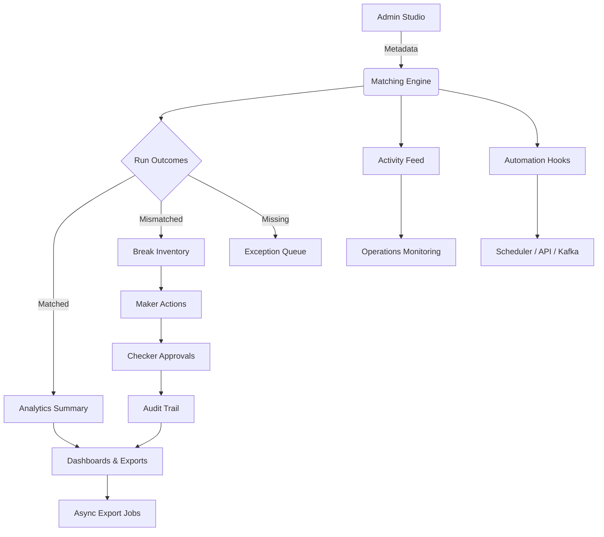

# Feature Compendium

This compendium enumerates the major capabilities delivered by the Universal Reconciliation Platform. Use it to scope new work,
align stakeholders, and ensure downstream teams understand the breadth of functionality available today.

## 2024 Highlights

| Theme | Enhancements | What Changed |
| --- | --- | --- |
| **Metadata-First Configuration** | Canonical fields, source adapters, and report templates authored in the admin studio | All reconciliation metadata is stored in relational tables; admins can publish updates without Java deployments. |
| **Dynamic Analyst Workspace** | Virtualised break grid, saved views, server-side selection | Analysts query any run with cursor pagination, persist layouts, and perform “select filtered” bulk actions. |
| **Maker-Checker Workflow** | Approval queue, bulk transitions, audit history | Break actions resolve allowed transitions via `BreakAccessService`, write audit rows, and expose a checker queue API. |
| **Export Flexibility** | Async dataset jobs, synchronous run exports, metadata-rich payloads | CSV/JSONL/XLSX exports capture filters, hash, row count, and use background jobs to avoid blocking UI threads. |
| **Ingestion Telemetry** | Source batch uploads with SLAs and activity feed integration | Multipart ingestion endpoint stores batches, checksums, and surfaces success/failure in the activity feed. |

## Executive Overview
- **Audience:** product owners, delivery leads, and stakeholders who need a concise overview of platform value.
- **Outcome:** rapid mapping of high-level features to the services that power them.



## Capability Matrix
| Domain | Feature | Description | Key Consumers |
| --- | --- | --- | --- |
| Configuration | Canonical metadata authoring | Define sources, canonical fields, transformations, reports, and entitlements without code changes. | Reconciliation administrators |
| Configuration | Pluggable ingestion adapters | Register CSV/JDBC/API connectors with SLA metadata and options for downstream automation. | Data engineering |
| Matching | Rule-based engine | Execute deterministic passes with tolerance-aware comparators derived from canonical field definitions. | Matching engine |
| Matching | Run orchestration | Trigger via UI, API, or scheduler with correlation IDs and comments for audit. | Operations teams |
| Workflow | Break classification | Persist full source payloads plus flattened attributes for filtering and analytics. | Makers |
| Workflow | Maker-checker lifecycle | Enforce approval flows, capture comments, and maintain immutable audit trails with correlation IDs. | Makers, checkers |
| Workflow | Bulk actions | Use server-side selection to update or annotate thousands of breaks in a single operation. | Makers |
| Analytics | Real-time dashboards | Expose run summaries, approval queues, and break distributions to the SPA through lightweight DTOs. | Analysts, leadership |
| Analytics | Saved views | Persist personalised grid layouts, share via tokens, and set user defaults. | Analysts |
| Reporting | Async dataset exports | Queue CSV/JSONL/XLSX jobs with full filter context, poll status, and download artifacts when ready. | Analysts, audit |
| Reporting | Immediate run exports | Generate XLSX summaries for any run, including filter metadata and audit notes. | Analysts |
| Security | LDAP-authenticated access | Authenticate via LDAP, map groups to roles, and enforce dimensional entitlements. | Platform users |
| Observability | Activity feed | Chronicle runs, workflow transitions, exports, and configuration publishes for support teams. | Support, risk |
| Observability | Metrics & health checks | Spring Boot actuators and Jacoco coverage thresholds guard code health. | SRE teams |

## Feature Deep Dive

### 1. Admin Studio & Metadata Lifecycle
- **Canonical field designer:** map each logical attribute to source columns with transformation chains and tolerances.
- **Source catalog:** capture adapters, arrival expectations, and connection metadata for automated SLAs and monitoring.
- **Entitlement matrix:** bind LDAP groups to products/entities, define maker/checker roles, and opt into notifications.
- **Versioned publishes:** optimistic locking with `version` column prevents conflicting updates; publish and retire actions are audited.

### 2. Matching & Analytics Engine
- **Deterministic execution:** engine derives matching keys, comparators, and classification rules directly from metadata.
- **Analytics DTOs:** `RunDetailDto` packages summaries, dimensional aggregates, and filter metadata for the SPA.
- **Activity integration:** every run emits a system event (`RECONCILIATION_RUN`) for dashboards and downstream hooks.

### 3. Workflow & Case Management
- **Maker tools:** comment, annotate, and submit breaks for approval with role-aware transitions and validation.
- **Checker console:** dedicated `/approvals` endpoint surfaces pending items capped by configurable queue size.
- **Audit fabric:** `break_workflow_audit` and `break_comments` capture actor DN, role, comment, and correlation IDs.

### 4. Analyst Experience
- **Virtualised grid:** cursor pagination via `/results` scales to hundreds of thousands of rows with server-side filtering.
- **Saved views:** analysts persist filters and layouts in `analyst_saved_views`, share tokens, and set defaults per reconciliation.
- **Server-side selection:** `/results/ids` returns break identifiers and totals to back “select filtered” workflows.

### 5. Reporting & Exports
- **Async export jobs:** background processor iterates cursor pages, writes CSV/JSONL/XLSX via `DatasetExportWriter`, and stores payloads in `export_jobs`.
- **Integrity metadata:** each export stores hash, row count, timezone, and filter snapshot to simplify reconciliations.
- **Run-level Excel export:** `/api/exports/runs/{runId}` uses report templates to produce formatted XLSX files on demand.

### 6. Integration Surface
- **REST APIs:** full coverage for metadata management, run orchestration, break search, approvals, exports, and saved views.
- **Automation ready:** APIs accept correlation IDs, support cron-trigger use cases, and expose consistent error responses.
- **Extensible ingestion:** multipart upload endpoint accepts adapter options and labels for pipeline integration.

### 7. Security & Compliance
- **Unified identity:** JWT tokens embed LDAP groups; access control entries enforce product/entity scoping and roles.
- **Notification hooks:** access entries optionally deliver publish/ingestion alerts to e-mail or chat channels via stored endpoints.
- **Audit completeness:** activity feed, break audit trails, and export metadata provide end-to-end traceability.

### 8. Operations & Support
- **Activity feed dashboards:** `/api/activity` lists recent events, enabling control room monitoring of runs, approvals, and exports.
- **Jacoco-guarded builds:** backend tests enforce coverage thresholds; the Playwright suite exercises analyst/admin surfaces.
- **Ingestion diagnostics:** batch status, checksums, and timestamps help triage missing or delayed feeds.

## Roadmap Snapshot

```mermaid
gantt
    dateFormat  YYYY-MM-DD
    title Capability Delivery Roadmap
    section Core Engine
    Metadata Convergence              :done,    ce1, 2023-10-01, 2024-02-29
    Analytics DTO Enhancements        :done,    ce2, 2024-03-01, 2024-04-30
    section Workflow & UI
    Saved View Sharing                :done,    wu1, 2024-02-15, 2024-03-30
    Approval Queue Optimisation       :done,    wu2, 2024-04-01, 2024-05-31
    section Reporting & Automation
    Async Dataset Exports             :done,    ra1, 2024-03-15, 2024-06-15
    Export Observability              :active,  ra2, 2024-07-01, 2024-09-30
    section Continuous Investment
    Admin Studio Iterations           :active,  ci1, 2024-07-15, 2024-10-31
    Activity Feed Enhancements        :planned, ci2, 2024-09-01, 2024-11-30
```

Update milestones as delivery progresses and append future initiatives as they are approved. Keep the table above aligned with
release notes so stakeholders can map roadmap items to shipped functionality.
