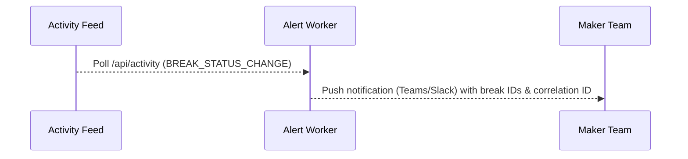

# Reconciliation Onboarding Playbook

Use this playbook to introduce new reconciliations into the Universal Reconciliation Platform with confidence. It blends
governance checklists, configuration recipes, and automation examples so teams can reach production readiness quickly.

## 1. Before You Begin
- **Stakeholders aligned:** confirm business owners, reconciliation administrators, data engineering, and compliance sign-off.
- **Data readiness:** source schemas mapped, sample payloads available, and canonical attributes agreed.
- **Access:** required LDAP groups (makers, checkers, viewers, admins) exist and are provisioned in the directory.
- **Environment health:** lower environments pass backend tests (`./mvnw test`) and Playwright smoke suites before onboarding.
- **Monitoring:** observability endpoints (activity feed, metrics) wired into control room dashboards.

## 2. Onboarding Checklist
| Phase | Activities | Owner | Deliverables |
| --- | --- | --- | --- |
| Scoping | Document business rules, matching tolerances, workflow requirements, and dimensional filters. | Product owner | Approved requirements brief |
| Data Prep | Build/adjust ETL pipelines to stage normalised source data with canonical keys. | Data engineering | Sample CSV/flat files or JDBC views |
| Configuration | Create reconciliation definition, sources, canonical fields, and report templates in the Admin Studio or via API. | Recon admin | Published metadata version |
| Security | Map LDAP groups to access control entries (viewer/maker/checker roles plus optional notifications). | Security admin | Access control matrix |
| Verification | Ingest sample batches, execute runs, validate breaks, and confirm analytics/export behaviour. | Recon admin & analysts | Run acceptance report |
| Automation | Set up cron triggers, API orchestration, or upstream notifications using correlation IDs. | Operations | Automation runbook |
| Go-Live | Promote metadata, enable monitoring alerts, and communicate cutover timelines. | Project lead | Launch announcement |

## 3. Worked Example: Cash vs General Ledger

### 3.1 Canonical Mapping
| Attribute | Role | Source A Column | Source B Column | Notes |
| --- | --- | --- | --- | --- |
| `accountNumber` | KEY | `cash_account` | `gl_account` | Primary match key |
| `valueDate` | KEY | `value_date` | `posting_date` | `DATE_ONLY` comparison |
| `balance` | COMPARE | `balance_ccy` | `balance_ccy` | ±0.5% tolerance |
| `currency` | DISPLAY | `currency` | `currency` | Shown in grid/export |
| `product` | PRODUCT | `product` | `product` | Drives entitlements |
| `entityName` | ENTITY | `entity` | `entity` | Used for filtering |

### 3.2 Configuration Steps (Admin API)
1. **Create the definition** via `POST /api/admin/reconciliations` supplying sources, canonical fields, and access entries (see
   [Tutorial](./Tutorial-Creating-a-New-Reconciliation.md) for a full payload example).
2. **Verify metadata** by calling `GET /api/admin/reconciliations/{id}` and reviewing canonical field mappings and report templates.
3. **Upload source batches** for each adapter using the multipart endpoint `/api/admin/reconciliations/{id}/sources/{sourceCode}/batches`.
4. **Publish** (if authored in draft) by updating the `status` to `PUBLISHED` with `PUT` or `PATCH` once validations pass.

### 3.3 Workflow Setup
- **Maker group:** `CN=RECON_MAKERS,OU=Groups,DC=corp,DC=internal`
- **Checker group:** `CN=RECON_CHECKERS,OU=Groups,DC=corp,DC=internal`
- **Viewer group:** `CN=RECON_VIEWERS,OU=Groups,DC=corp,DC=internal`
- Configure these groups in the `accessControlEntries` payload and opt into publish/ingestion notifications as needed.

### 3.4 Dry Run Validation
1. Ingest sample data for each source and confirm ingestion batches appear in the activity feed.
2. Trigger a run via `POST /api/reconciliations/{id}/run` with a unique `correlationId`.
3. Inspect run analytics (`GET /api/reconciliations/runs/{runId}`) and break search results (`/results`).
4. Submit a sample break for approval and ensure the checker queue (`/approvals`) populates correctly.
5. Queue an export job to confirm CSV/XLSX payloads include filters, hashes, and row counts.

### 3.5 Promotion Between Environments
1. Export the definition using `GET /api/admin/reconciliations/{id}/schema` and commit the JSON package to source control.
2. Import into the target environment via the same `POST /api/admin/reconciliations` endpoint, review differences, then publish.
3. Re-run backend tests and the Playwright smoke suite to confirm parity after promotion.

## 4. Automation Patterns

### 4.1 Scheduled Reconciliation Runs
```mermaid
graph TD
  Cron[Cron Scheduler] -->|05:00 Daily| RunAPI[/api/reconciliations/{id}/run]
  RunAPI --> Engine[Matching Engine]
  Engine --> Activity[System Activity Feed]
  Activity --> Notify[Ops Alerts]
```
- Use enterprise schedulers or Kubernetes CronJobs to call the run endpoint with correlation IDs and comments.
- Monitor `/api/activity` for the corresponding `RECONCILIATION_RUN` event and raise alerts if it is missing.

### 4.2 Automated Break Alerts

- Poll the activity feed for `BREAK_STATUS_CHANGE` or `BREAK_BULK_ACTION` entries tied to critical reconciliations.
- Include links to the analyst workspace with saved-view tokens for quick triage.

### 4.3 Evidence Exports
```mermaid
graph TD
  Analyst -->|Filters| Results[/api/reconciliations/{id}/results]
  Analyst --> ExportReq[/api/reconciliations/{id}/export-jobs]
  ExportReq --> Job[Export Job Service]
  Job -->|COMPLETED| Download[/api/export-jobs/{jobId}/download]
```
- Store job IDs with correlation IDs so audit teams can reproduce the exact export using `/download`.
- Fail pipelines fast if `/api/export-jobs/{jobId}` reports `FAILED`; error details are persisted on the job row.

## 5. Database Touchpoints
- **Configuration:** `reconciliation_definitions`, `reconciliation_sources`, `canonical_fields`, `canonical_field_mappings`, `report_templates`, `report_columns`, `access_control_entries`.
- **Ingestion:** `source_data_batches`, `source_data_records` (includes checksums and ingestion timestamps).
- **Run History:** `reconciliation_runs`, `break_items`, `break_classification_values`.
- **Workflow Audit:** `break_comments`, `break_workflow_audit`, `system_activity_logs`.
- **Analyst Preferences:** `analyst_saved_views`.
- **Exports:** `export_jobs` (payload, hash, row count, status).

Ensure schema migrations or Liquibase/Flyway scripts are versioned alongside metadata exports when promoting to higher environments.

## 6. Post-Go-Live Activities
- Monitor the activity feed during the first week and document any anomalies or SLA breaches.
- Review export job history daily to ensure asynchronous jobs complete successfully.
- Schedule quarterly access reviews to validate LDAP group membership aligns with maker/checker obligations.
- Refresh documentation and saved views when new canonical fields or tolerance adjustments are introduced.

## 7. Appendix

### 7.1 Sample `curl` Snippets
```bash
# Trigger a reconciliation run with correlation metadata
curl -X POST "$BASE_URL/api/reconciliations/101/run" \
  -H "Authorization: Bearer $TOKEN" \
  -H "Content-Type: application/json" \
  -d '{"triggerType":"SCHEDULED_CRON","correlationId":"MONTH_END","comments":"Automated schedule"}'

# Collect break IDs for bulk action
curl -H "Authorization: Bearer $TOKEN" \
  "$BASE_URL/api/reconciliations/101/results/ids?status=OPEN&filter.product=Equities"
```

### 7.2 Maker Acceptance Script
1. Open an open break via the analyst workspace.
2. Add a comment referencing supporting evidence.
3. Transition to `PENDING_APPROVAL`, capturing the timestamp and correlation ID.
4. Checker approves the break; verify `break_workflow_audit` records both actions.

### 7.3 Troubleshooting Matrix
| Symptom | Resolution |
| --- | --- |
| Scheduled run skipped | Validate cron invocation, confirm `autoTriggerEnabled` settings, and inspect `/api/activity` for failures. |
| Export email lacks attachment | Check `export_jobs` for `FAILED` status and review the stored `error_message`. |
| Break count spikes unexpectedly | Review latest ingestion batches and canonical field tolerances before adjusting workflow rules. |
| Saved view missing filters | Ensure `settingsJson` captures the required filters and the view is marked as shared/default where applicable. |

Keep this playbook current as reconciliations evolve, new ingestion adapters are added, or governance expectations change.
