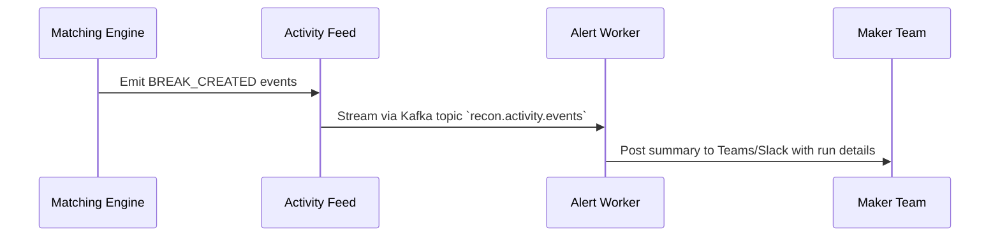

# Reconciliation Onboarding Playbook

Use this playbook to introduce new reconciliations into the Universal Reconciliation Platform with confidence. It blends governance checklists, configuration recipes, and automation examples so teams can reach production readiness quickly.

## 1. Before You Begin
- **Stakeholders aligned:** confirm business owners, reconciliation administrators, data engineering, and compliance sign-off.
- **Data readiness:** source A and source B data structures are documented, and sample files have been validated.
- **Access:** required LDAP groups exist (makers, checkers, viewers) and have been provisioned in the enterprise directory.
- **Environments:** lower environments (dev/QA) are available for dry runs before promoting to production.

## 2. Onboarding Checklist
| Phase | Activities | Owner | Deliverables |
| --- | --- | --- | --- |
| Scoping | Document business rules, tolerances, workflow requirements. | Product owner | Approved requirements brief |
| Data Prep | Build or update ETL pipelines to stage normalized records. | Data engineering | Populated staging tables |
| Configuration | Create reconciliation definition, fields, matching rules, and report templates via the Admin Configurator. | Recon admin | Published metadata version |
| Security | Map LDAP groups to access scopes and workflow roles. | Security admin | Access control matrix |
| Verification | Execute dry runs, validate breaks, review dashboards, and confirm reports. | Recon admin & analysts | Run acceptance report |
| Automation | Configure schedules, APIs, or Kafka triggers for production workloads. | Operations | Automation runbook |
| Go-Live | Promote configurations, enable monitoring, communicate cutover. | Project lead | Launch announcement |

## 3. Production Example: Cash vs General Ledger

### 3.1 Data Mapping
| Attribute | Source A (Cash) | Source B (GL) | Notes |
| --- | --- | --- | --- |
| `transaction_id` | `cash_txn_id` | `journal_line_id` | Primary match key |
| `value_date` | `value_date` | `posting_date` | Date tolerance ±1 day |
| `amount` | `amount` | `amount_home` | Numeric tolerance ±0.5% |
| `currency` | `currency_code` | `currency_code` | Exact match |
| `account` | `account_number` | `gl_account` | Display only |

### 3.2 Configuration Method
Author the reconciliation directly in the **Admin Configurator**:

1. Navigate to **Admin → Reconciliations → New definition**.
2. Provide metadata (code, name, description) and assign ownership and maker/checker defaults.
3. Define sources, selecting adapter types (CSV, JDBC, API) and configuring adapter-specific options.
4. Add canonical fields, tagging keys, compare fields, products, sub-products, and entities.
5. Build report templates with tabs, column ordering, and formatting hints.
6. Configure access control entries mapping LDAP groups to viewer/maker/checker roles.
7. Save the draft and publish it when validation passes; the platform versions the metadata automatically.

If you need to bootstrap via API (for automation or migration), export a metadata package from the UI and POST it to `/api/admin/reconciliations` as documented in the **[Admin Configurator Guide](./Admin-Configurator-Guide.md)** and **[API Reference](./API-Reference.md)**.

### 3.3 Workflow Setup
- **Maker group:** `cn=recon-makers,ou=groups,dc=corp,dc=internal`
- **Checker group:** `cn=recon-checkers,ou=groups,dc=corp,dc=internal`
- **Viewer group:** `cn=recon-ops,ou=groups,dc=corp,dc=internal`
- Grant access scopes (product `Payments`, entity `US`) using `/api/access-control` endpoints.

### 3.4 Dry Run Validation
1. Load sample data into staging tables via ETL pipeline.
2. Trigger run manually through UI and review analytics for expected break distribution.
3. Validate maker dashboard filters, drill-down views, and attachments.
4. Generate ad-hoc Excel export and compare totals to source systems.
5. Capture screenshots and run IDs for sign-off artifacts. Attach the Playwright regression evidence bundle from `automation/regression/reports/latest/` when available.

### 3.5 Promote Between Environments
1. From the reconciliation detail view, select **Export package** to download the JSON metadata bundle.
2. In the target environment, import the package and review the diff summary before publishing.
3. Re-run smoke tests and the automation regression suite to confirm parity.

## 4. Automation Patterns

### 4.1 Scheduled Reconciliation Runs
```mermaid
graph TD
  Cron[Cron Scheduler] -->|05:00 Daily| API[/api/reconciliations/{id}/runs]
  API --> Engine[Matching Engine]
  Engine --> Results[Run Summary + Breaks]
  Results --> Notify[Email/Chat Notifications]
```
- Configure Spring Scheduling or an enterprise orchestrator (Control-M, Autosys) to call the run endpoint daily at 05:00 local time.
- Include `correlationId` and `initiatedBy` metadata for traceability.

### 4.2 Automated Break Review Alerts

- Deploy a lightweight worker (Spring Cloud Stream, Node.js) to consume activity events and notify maker teams when breaks exceed thresholds.

### 4.3 Scheduled Report Generation
```json
POST /api/reports/schedules
{
  "reconciliationId": "cash-gl",
  "template": "cash-gl-daily",
  "cronExpression": "0 30 6 * * MON-FRI",
  "delivery": {
    "method": "EMAIL",
    "recipients": ["cash-ops@example.com", "finance-controller@example.com"],
    "subject": "Daily Cash vs GL Reconciliation",
    "body": "Attached is the reconciled break report for ${runDate}."
  }
}
```
- Reports are persisted to the configured storage root and optionally mirrored to S3 or SharePoint.
- Each delivery event is logged in the activity feed for audit review.

## 5. Database Touchpoints
- Staging tables: `recon_source_a_cash`, `recon_source_b_gl` (custom ETL-managed).
- Configuration tables: `reconciliation_definitions`, `reconciliation_sources`, `reconciliation_fields`, `report_templates`, `report_columns`.
- Ingestion telemetry: `ingestion_batches`, `ingestion_batch_events` (records adapter runs and outcomes).
- Run tables: `reconciliation_runs`, `break_items`, `break_workflow_audit`, `break_comments`, `break_attachments`, `analytic_snapshots`.
- Security tables: `access_control_entries`, `group_scope_mappings`.

Ensure Liquibase or Flyway migrations include new templates and reference data when promoting to higher environments.

## 6. Post-Go-Live Activities
- Monitor first-week runs closely, documenting anomalies and remediation steps.
- Review activity feed and export logs daily to confirm scheduled processes succeeded.
- Update wiki entries with lessons learned and adjustments to tolerances or workflows.
- Schedule quarterly access reviews to validate LDAP group membership.

## 7. Appendix

### 7.1 Sample ETL Snippet (Pseudo-code)
```java
public class CashGlPipeline extends AbstractSampleEtlPipeline {
    @Override
    protected void loadSourceData() {
        loadCsv("/etl/cash_source.csv", cashRepository::saveAll);
        loadCsv("/etl/gl_source.csv", glRepository::saveAll);
    }
}
```

### 7.2 Maker Acceptance Script
1. Open break `BRK-2024-03-15-001`.
2. Attach PDF evidence and add comment "Confirmed GL entry missing counterpart".
3. Transition to `PENDING_APPROVAL` and capture timestamp.
4. Checker approves and verifies audit log contains maker/checker groups.

### 7.3 Troubleshooting Matrix
| Symptom | Resolution |
| --- | --- |
| Scheduled run skipped | Validate cron syntax, timezone configuration, and orchestrator logs. |
| Report email missing attachment | Check storage root permissions and template column definitions. |
| Break volume spikes unexpectedly | Review upstream ETL changes and tolerance configurations before adjusting workflow rules. |

Keep this playbook updated as reconciliations evolve or new automation tooling is introduced.
